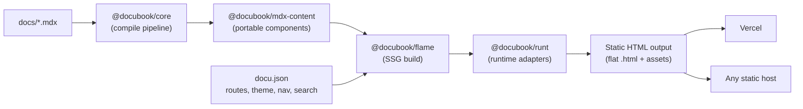
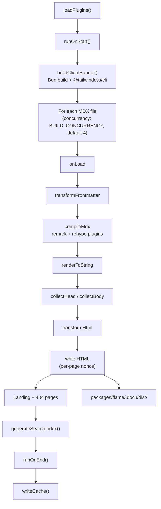

# DocuBook — Architecture

> System architecture overview for the DocuBook monorepo. Kept intentionally
> concise and version-free — package versions live in each `package.json`.

## System Purpose

**DocuBook** is a static site generator for documentation — compiles MDX content
into flat `.html` files. A shared compilation pipeline (`@docubook/core`),
portable UI components (`@docubook/mdx-content`), and runtime adapters
(`@docubook/runt`) work together to produce pure static output. The **flame**
framework is the recommended consumer, running on Bun, Node.js, or Deno — it
deploys to Vercel or any static host. The Next.js and React Router starter
templates are **deprecated** and no longer maintained (see the warning in
[README.md](./README.md)).

**Scope boundaries:** content authoring and rendering only. No CMS, no user
authentication, no database. Content is file-based (`.mdx`), configuration is
declarative (`docu.json`), deployment is CI-driven. Output is pure static
HTML + assets — no server needed in production.

## Package Inventory

| Package | Path | Role |
|---------|------|------|
| `@docubook/core` | `packages/core` | MDX compilation pipeline — unified/remark/rehype plugins, frontmatter, TOC, code blocks, `createMdxContentService()` facade, git date integration. Pure TypeScript, no React dependency. |
| `@docubook/mdx-content` | `packages/mdx-content` | Portable React MDX components (Accordion, Tabs, CodeBlock, Note, Card, FileTree, Stepper, and more) with framework adapters: `./next` (Next.js image + link), `./client`, `./server`. |
| `@docubook/flame` | `packages/flame` | SSG framework — incremental build, plugin system, island hydration, dev server with HMR, search index. Builds the production docs site (docubook.pro). Runs on Bun (native path), Node.js, and Deno (via `@docubook/runt` + precompiled `.docu/lib`). |
| `@docubook/runt` | `packages/runtime` | Runtime HTTP server adapters — `RuntimeAdapter` interface with `bunAdapter` (`Bun.serve`), `nodeAdapter` (streaming `http.createServer` bridge to Web `Request`/`Response`), and `denoAdapter` (`Deno.serve`). Zero dependencies. |
| `@docubook/ui-react` | `packages/ui/react` | Reusable DaisyUI + Tailwind CSS React component library (Collapse, Modal, Dropdown, Drawer, Navbar, Pagination, and more). Consumed by flame. Note the path: `packages/ui/react`, not `packages/ui-react`. |
| `@docubook/themes-colors` | `packages/themes-colors` | Theme color presets (default, freshlime, coffee) — CSS variables per light/dark mode plus syntax highlighting tokens. Consumed by flame via `docu.json → theme.colors`. |
| `@docubook/cli` | `packages/cli` | Node.js scaffolding CLI (Commander) — template selection, project init, package manager detection. Downloads templates from GitHub release artifacts. |

### Monorepo Infrastructure

- **pnpm workspaces** — strict dependency resolution; `react`/`react-dom` and
  their types are force-pinned via `overrides` in root `pnpm-workspace.yaml`.
- **Turborepo** — orchestrates `build`, `lint`, `typecheck`, `test` with
  content-hash caching.
- **Changesets** — independent versioning per published package.
- **Husky + commitlint** — conventional commits enforced on commit and push
  (see [CONTRIBUTING.md](./CONTRIBUTING.md)).
- **GitHub Actions** — matrix CI: lint, typecheck, build, test. Bun is used
  for flame builds; pnpm with `--frozen-lockfile` everywhere else.

## Data Flow

> The runtime (Bun, Node.js, Deno) is only needed for the build toolchain and
> local dev server. The final output is flat static HTML — deploy to any CDN or
> static host.

### Build Pipeline

`packages/flame/.docu/node/build.ts`:

Output: landing `index.html`, `404.html`, and pages as flat `docs/<slug>.html`
files with extensionless internal links (static hosts need `cleanUrls`-style
rewriting).

The client bundle is built with ESM code splitting (`splitting: true` in both
the Bun and esbuild bundlers). The entry chunk (`client-[hash].js`) is the only
file referenced from HTML via a single `<script type="module">`; the browser
natively follows its `import` statements to shared/dynamic chunks under
`assets/chunks/`. Heavy dynamically-imported modules (e.g. `mermaid`) ship as
separate chunks fetched on demand, not inlined into every page's critical path.
daisyUI is configured via `@plugin "daisyui"` with only the `light` and `dark`
themes to avoid emitting all ~35 built-in themes.

## Deployment

The production docs site is built by flame and deployed to Vercel as static
output. Root `vercel.json` is the source of truth: it sets `"framework": null`
(forces the static preset), builds with `turbo build --filter=@docubook/flame...`,
serves `packages/flame/.docu/dist` with `cleanUrls`, and injects security
headers (CSP, HSTS, X-Frame-Options, and friends).

The CSP applied by the serving layer must include `script-src 'unsafe-eval'`:
flame pages hydrate MDX islands via `@docubook/mdx-remote`, which evaluates compiled
MDX at runtime. Static HTML itself carries per-page nonces but no CSP meta tag —
CSP always comes from the serving layer (dev/preview server headers or
`vercel.json` in production).

Hashed assets under `/assets/*` (bundles, chunks, CSS) are served with
`Cache-Control: public, max-age=31536000, immutable` — `vercel.json` sets this
for the Vercel deploy, and `flame deploy` writes a `_headers` file into the
output for Netlify/Cloudflare Pages (GitHub Pages ignores it; its CDN handles
caching separately).

## Key Decisions

Condensed from the retired ADRs — these commitments are still in force:

1. **Monorepo with pnpm + Turborepo + Changesets.** Strict dependency
   isolation, cached builds, independent package versioning. All contributors
   must use pnpm (pinned via `packageManager`).
2. **Shared MDX pipeline as `@docubook/core`.** One plugin chain for every
   framework — bug fixes propagate via version bump; no per-framework drift.
3. **`docu.json` as universal configuration.** Framework-agnostic JSON drives
   routes, navigation, theme, and search. Validated by
   `packages/flame/docu.schema.json` (a published artifact — editing it ships
   to npm and warrants a changeset).
4. **DaisyUI for flame, Radix UI for the (deprecated) Next.js templates.**
   DaisyUI is CSS-only — minimal JS for static output; Radix provides
   accessible primitives where a full framework runtime exists.
   `@docubook/mdx-content` stays framework-agnostic.
5. **Island hydration in flame — mixed strategy.** `createRoot` for sidebar,
   mobile bar, and MDX content (avoids hydration mismatches); `hydrateRoot` for
   stable islands (TOC, theme toggle).
6. **Theme persistence per rendering mode.** Flame sets a `dark` class on
   `documentElement` via a blocking inline script reading `localStorage`
   (prevents FOUC); Next.js templates use `next-themes`. Theme-reactive
   components must observe the class, not `matchMedia`.
7. **Incremental builds with content hashing.** SHA-256 per-file hashes in
   `build-cache.json` skip unchanged pages; asset hash changes trigger a full
   rebuild; `--force`/`--clean` for manual rebuilds.
8. **Dual Tailwind pipeline.** Flame uses `@tailwindcss/cli` (Bun has no
   PostCSS); Next.js templates use `@tailwindcss/postcss`. Both produce
   identical CSS.
9. **Flame plugin system — hook-based, zero-config.** `DocuBookPlugin`
   interface (`name` + `setup(build)`) with 10 hooks: `onStart`, `onLoad`,
   `transformFrontmatter`, `remarkPlugins`, `rehypePlugins`, `injectHead`,
   `injectBody`, `transformHtml`, `onEnd`, `handleRequest` (dev server, first
   `Response` wins). Sequential execution in registration order; no plugins
   means no behavior change. Implementation:
   `packages/flame/.docu/node/plugin.ts`.
10. **Multi-runtime via duplication at the entry layer, not abstraction of Bun
    code.** The Bun entry files (`server.ts`, `build.ts`, `preview.ts`,
    `html.ts`, `hydrate.ts`, `utils.ts`, `deploy.ts`) are frozen for backward
    compatibility. Node/Deno get parallel entries (`*.node.ts` / `*.deno.ts`
    over shared `*.impl.ts`) that swap only the Bun-coupled leaves:
    `html.shared.ts` (pure `escapeHtml`), `git.ts` (`child_process`),
    `hydrate.node.ts` (esbuild client bundling). Non-protected shared modules
    (`server-routes.ts`, `mdx.ts`) were neutralized in place with `node:` APIs,
    which Bun runs natively. HTTP serving goes through `@docubook/runt`
    adapters. Because Node cannot import `.tsx` and Deno does not execute
    TypeScript inside npm packages, `bin/compile-lib.mjs` bundles the
    Node/Deno entries to plain ESM in `.docu/lib/` at publish time; the CLI
    (`bin/cli.js`) detects the runtime (`FLAME_RUNTIME` override → `Bun`
    global → `Deno` global → node) and routes Bun to `.docu/node/*.ts`,
    others to `.docu/lib/*.js`.

## Testing

- Vitest per package: `cd packages/<name> && pnpm test`.
- Core tests: pure MDX compilation. mdx-content: component rendering with
  `@testing-library/react`. Flame: build pipeline, server, plugin system
  (suites in `packages/flame/.docu/__tests__/`). CLI: prompts and template
  download.
- Flame suites import `@docubook/core` — build it first:
  `npx turbo run build --filter=@docubook/core`.

## Trade-offs & Limitations

| Limitation | Impact | Mitigation |
|-----------|--------|------------|
| No dynamic content — MDX files only, no database/CMS | No user-generated content or real-time updates | Acceptable for documentation |
| Bun-only code paths duplicated for Node/Deno (entry layer) | Fixes to protected Bun entries may need mirroring in `*.impl.ts` counterparts | Duplication is confined to thin entries + three leaf modules; shared logic lives in neutral modules |
| `unsafe-eval` in serving CSP | Weakens CSP against XSS | Required by `@docubook/mdx-remote` island hydration; all other CSP directives stay strict |
| Single `docu.json` config — no dynamic route generation | Routes cannot come from external APIs | Covers documentation use cases |
