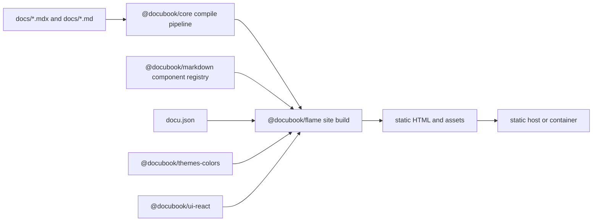
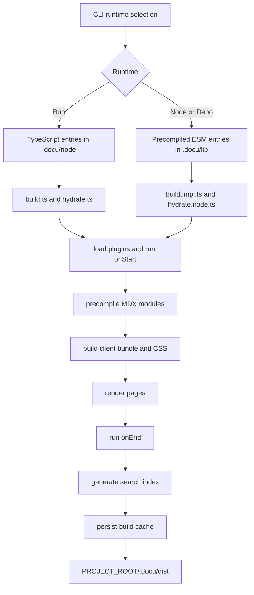

# DocuBook — Architecture

> System architecture overview for the DocuBook monorepo. Kept intentionally
> concise and version-free — package versions live in each `package.json`.

## System Purpose

**DocuBook** is a documentation-focused static site generator. Authors write
markdown/MDX content plus directive-based components, and **flame** turns that
content into static HTML, CSS, and browser assets.

The monorepo is split into reusable packages:

- `@docubook/core` owns the shared MDX compile pipeline and client renderer
- `@docubook/markdown` provides portable React components and the directive registry
- `@docubook/flame` builds and serves the documentation site
- `@docubook/themes-colors` provides theme presets and color utilities
- `@docubook/ui-react` provides reusable React UI primitives for flame

**Scope boundaries:** file-based docs authoring and rendering only. No CMS, no
user auth, no database. Project config is declarative via `docu.json`.

## Package Inventory

| Package | Path | Role |
|---------|------|------|
| `@docubook/core` | `packages/core` | Shared MDX compile pipeline: `serialize`, `MDXRemote`, frontmatter and TOC extraction, default remark/rehype plugins, and directive compilation via `remarkDirectiveToMdx`. Ships native ESM with `.`, `./utils`, and `./serialize` exports. |
| `@docubook/markdown` | `packages/markdown` | Portable React MDX components and the `createMdxComponents()` registry. Ships native ESM plus `styles.css`. |
| `@docubook/flame` | `packages/flame` | Static site generator and CLI. Bun executes TypeScript source entries directly; Node and Deno use compatibility entries precompiled to `.docu/lib/`. |
| `@docubook/themes-colors` | `packages/themes-colors` | Theme presets, CSS variable generation, color utilities, and passthrough `themes/*` and `syntax/*` exports. Ships native ESM via Vite library mode. |
| `@docubook/ui-react` | `packages/ui-react` | DaisyUI + Tailwind React primitives consumed by flame and published as an ESM-only, multi-entry package with component and stylesheet subpath exports. |

### Historical Renames

These names still appear in comments, tests, or compatibility paths in places,
but they are no longer the active package identities in this repository:

- `@docubook/mdx-remote` → folded into `@docubook/core`
- `@docubook/mdx-content` → renamed to `@docubook/markdown`
- `@docubook/ui/react` → renamed to `@docubook/ui-react`
- `@docubook/runt` → runtime code absorbed into flame

## Monorepo Infrastructure

- **pnpm workspaces** — root dependency management, shared overrides, and native build allow-list in `pnpm-workspace.yaml`
- **Turborepo** — orchestrates `build`, `lint`, `typecheck`, and `test`
- **Vite 8 + Rolldown** — library build pipeline for `core`, `markdown`, `themes-colors`, and `ui-react`; also used in flame's Node/Deno compatibility bundling
- **Changesets** — linked versioning for the five published packages
- **Husky + lint-staged + commitlint + czg** — local commit/push enforcement
- **GitHub Actions** — CI matrix, PR commit linting, npm/GitHub releases, and flame builder image publication

### Release Model

The five published packages are linked in `.changeset/config.json`:

- `@docubook/core`
- `@docubook/flame`
- `@docubook/markdown`
- `@docubook/themes-colors`
- `@docubook/ui-react`

As a result, a release affecting one of these packages may version and publish
all linked packages together. The repository is currently in stable release
mode: `.changeset/pre.json` is absent. Prerelease mode must be entered
explicitly when another prerelease series is needed.

## High-Level Data Flow

```mermaid
flowchart LR
    A["docs/*.mdx and docs/*.md"] --> B["@docubook/core compile pipeline"]
    B --> D["@docubook/flame site build"]
    C["@docubook/markdown component registry"] --> D
    E["docu.json"] --> D
    F["@docubook/themes-colors"] --> D
    G["@docubook/ui-react"] --> D
    D --> H["static HTML and assets"]
    H --> I["static host or container"]
```

## Flame Build and Runtime Flow

`packages/flame/bin/cli.js` selects Bun, Node, or Deno. `FLAME_RUNTIME` can
override detection, and `--bun` requests Bun explicitly.

- Bun executes `build.ts`, `server.ts`, `preview.ts`, `deploy.ts`, and `clean.ts`
  from `.docu/node/`.
- Node and Deno execute precompiled ESM from `.docu/lib/`. Their thin entries
  delegate to `build.impl.ts`, `server.impl.ts`, `preview.impl.ts`,
  `deploy.shared.ts`, and adapters under `runtime/`.
- `bin/compile-lib.mjs` builds the compatibility entries with Vite. In a source
  checkout, the CLI compiles `.docu/lib/` lazily when it is missing.

Bun uses standalone implementations rather than delegating to the neutral
`*.impl.ts` files. Both paths maintain the same behavior and output contract.

```mermaid
flowchart TD
    Start["CLI runtime selection"] --> Runtime{Runtime}
    Runtime -->|Bun| BunEntries["TypeScript entries in .docu/node"]
    Runtime -->|Node or Deno| CompatEntries["Precompiled ESM entries in .docu/lib"]
    BunEntries --> BunBuild["build.ts and hydrate.ts"]
    CompatEntries --> CompatBuild["build.impl.ts and hydrate.node.ts"]
    BunBuild --> Plugins["load plugins and run onStart"]
    CompatBuild --> Plugins
    Plugins --> PrePass["precompile MDX modules"]
    PrePass --> Bundle["build client bundle and CSS"]
    Bundle --> Render["render pages"]
    Render --> OnEnd["run onEnd"]
    OnEnd --> Search["generate search index"]
    Search --> Cache["persist build cache"]
    Cache --> Output["PROJECT_ROOT/.docu/dist"]
```

### Build Pipeline Details

`build.ts` and `build.impl.ts` follow the same high-level pipeline:

1. discover the project root, load `docu.json`, scan docs, and initialize plugins
2. run `onStart`, `onLoad`, and configured remark/rehype transforms
3. precompile every page and the docs index into ESM modules for hydration
4. reuse or build the browser bundle, asset manifest, and Tailwind CSS
5. render nested docs routes, the docs root, landing page, and `404.html` with SEO
6. run ordered HTML transforms and `onEnd` hooks
7. generate or reuse `assets/search-index.json`
8. atomically persist `.docu/build-cache.json`

### Runtime-Specific Bundling

#### Bun path

`packages/flame/.docu/node/hydrate.ts` builds the browser bundle with:

- `Bun.build()`
- virtual modules for `client-routes` and `mdx-manifest`
- Tailwind CSS via `@tailwindcss/cli`

#### Node/Deno path

`packages/flame/.docu/node/hydrate.node.ts` builds the browser bundle with:

- Vite build API on top of Rolldown
- virtual modules for `client-routes` and `mdx-manifest`
- a runtime-specific Lucide optimization layer
- stubs for Node built-ins that must not leak into the browser bundle
- Tailwind CSS via `@tailwindcss/cli`

Node and Deno compatibility entries are precompiled to `.docu/lib/` by
`packages/flame/bin/compile-lib.mjs`, which uses Vite 8 and emits entries for
build, server, preview, deploy, and clean flows.

### Output Contract

Flame resolves the directory containing `docu.json` as `PROJECT_ROOT` and
writes static output to `<PROJECT_ROOT>/.docu/dist/`. In this repository, that
becomes `packages/flame/.docu/dist/`.

The output includes:

- `index.html` for the landing page
- `docs/index.html` for the docs root
- nested `docs/<slug>.html` pages that preserve source paths
- `404.html`
- copied `docs/assets/`
- `assets/manifest.json`, hashed JS/CSS, and optional `assets/chunks/`
- `assets/search-index.json`

The incremental cache lives beside the output at
`<PROJECT_ROOT>/.docu/build-cache.json`. `flame deploy` also adds `.nojekyll`
and `_headers`. Bun and Node/Deno share this contract.

## MDX and Hydration Model

DocuBook uses a shared MDX pipeline from `@docubook/core` and a rendering
registry from `@docubook/markdown`.

Key properties:

- content is markdown-first
- directive syntax is the main authoring mechanism
- per-page MDX is precompiled into real ESM modules for static hydration
- the static build path avoids `new Function(compiledSource)` and does not need
  `'unsafe-eval'`
- development retains a legacy compiled-source fallback, and plugin responses
  from the dev server explicitly allow `'unsafe-eval'`
- deployed CSPs still allow `'unsafe-inline'` for scripts and styles

Hydration is island-based. Some islands hydrate existing SSR markup, while
others deliberately client-render from empty or intentionally disposable
containers.

## Deployment

### Monorepo Hosting

This repository's production docs use `vercel.json`:

- only production deployments proceed; preview deployments are ignored
- `framework: null`
- `buildCommand: turbo build --filter=@docubook/flame...`
- `installCommand: pnpm install --filter=@docubook/flame...`
- `outputDirectory: packages/flame/.docu/dist`
- `cleanUrls: true` and `trailingSlash: false`
- edge CSP, HSTS, frame, MIME, referrer, and permissions headers
- one-year caching for the docs OG image and 24-hour immutable caching for
  hashed `/assets/*`

### Flame Project Deployment

`flame deploy` first builds the current project and writes `.nojekyll` plus
`_headers`. Its default output is a GitHub Pages workflow. `flame deploy
--docker` instead generates `Dockerfile`, `nginx.conf`, and `.dockerignore`;
adding `--ci` also creates `.github/workflows/deploy-docker.yml` for GHCR.

### Package and Image Release

`.github/workflows/release.yml` runs on pushes to `main`. `changesets/action`
either opens or updates a Release PR, or publishes linked packages to npm after
that PR is merged. Per-package GitHub releases are disabled. After publish, the
workflow removes per-package tags, creates `v<flame version>`, creates one
GitHub release, and triggers `docker-builder.yml`.

The builder workflow publishes `ghcr.io/docubook/flame` with `<version>`,
`<major>`, and `latest` tags from `packages/flame/docker/Dockerfile.builder`.

## Key Decisions

1. **Single monorepo for all published packages.** Shared tooling, shared CI, and synchronized workspace development.
2. **Linked stable versioning.** Published packages are linked so releases move together; prerelease mode is opt-in and currently inactive.
3. **Native ESM as the package baseline.** `core`, `markdown`, `themes-colors`, and `ui-react` build with Vite 8 and ship ESM-first outputs; `ui-react` is ESM-only.
4. **Bun-first flame runtime.** Dev, build, preview, and deploy remain Bun-native for the main product path.
5. **Node/Deno compatibility via parallel entries.** Flame compiles `*.node.ts`, `*.deno.ts`, and shared clean entry points to `.docu/lib/`; neutral implementations and runtime adapters are shared by Node and Deno.
6. **Vite/Rolldown for compatibility bundling.** Flame now uses Vite 8 for both `.docu/lib` compilation and the Node/Deno browser-bundle path.
7. **Directive-first authoring.** Content authors work primarily in markdown/directive syntax rather than authoring JSX directly.
8. **Eval-free static hydration.** Per-page MDX becomes static ESM modules, avoiding runtime code evaluation in production builds; development keeps a compatibility fallback.
9. **Tailwind CLI as the CSS pipeline.** Both Bun and Node/Deno paths invoke `@tailwindcss/cli` rather than depending on a PostCSS app pipeline.
10. **Hook-based plugin model in flame.** Types live in `plugin.ts`, resolution and validation in `plugin-loader.ts`, and ordered collection/execution in `plugin-builder.ts`.

## Testing

Primary workspace commands:

- `pnpm build`
- `pnpm lint`
- `pnpm typecheck`
- `pnpm test`

Package-level validation:

- `packages/core` — MDX compile pipeline and plugin behavior
- `packages/markdown` — React component rendering and directive output
- `packages/themes-colors` — theme resolution and CSS generation
- `packages/ui-react` — React component primitives
- `packages/flame` — build pipeline, runtime adapters, plugin system, and static-site behavior

CI runs Turbo `lint`, `typecheck`, `build`, and `test` jobs on Node.js 22, plus
runtime smoke tests for flame on Node and Deno. The smoke jobs build workspace
dependencies, then exercise `bin/cli.js`; missing `.docu/lib` output is compiled
lazily before the compatibility build runs. A separate workflow validates every
commit in pull requests with commitlint.

## Trade-offs and Limitations

| Limitation | Impact | Mitigation |
|-----------|--------|------------|
| Bun remains the primary runtime for the main flame workflow | Contributors touching flame need Bun for the default dev/build path | Node and Deno compatibility is still tested and shipped through parallel entries |
| Bun and compatibility builds use parallel implementations | More surface area and risk of behavioral drift | Node/Deno share neutral `*.impl.ts` modules and adapters; smoke tests enforce the common output contract |
| Linked Changesets releases can publish more than one package for a single feature | Release scope is broader than strict per-package versioning | This is intentional and documented in the release model |
| Vite/Rolldown browser bundling on Node/Deno can emit many chunks for heavy browser dependencies | Output is more complex than the old single-file compatibility bundle | Hashed assets and generated manifest keep runtime resolution stable |
| Deployed CSPs allow `'unsafe-inline'`, and dev plugin responses may allow `'unsafe-eval'` | CSP is not maximally strict in every mode | Production hydration remains eval-free; static and development policies are documented separately |
| File-based configuration only | No dynamic route/content sourcing from external systems | Keeps the product focused on static documentation use cases |
