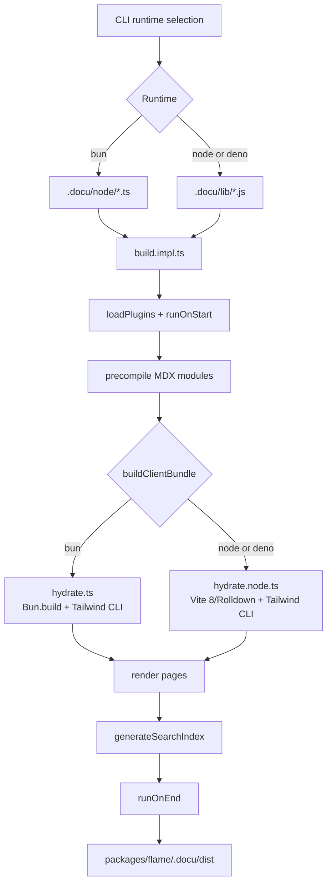

# DocuBook — Architecture

> System architecture overview for the DocuBook monorepo. Kept intentionally
> concise and version-free — package versions live in each `package.json`.

## System Purpose

**DocuBook** is a documentation-focused static site generator. Authors write
markdown/MDX content plus directive-based components, and **flame** turns that
content into static HTML, CSS, and browser assets.

The monorepo is split into reusable packages:

- `@docubook/core` owns the shared MDX compile pipeline and client renderer
- `@docubook/markdown` provides portable React components and the directive registry
- `@docubook/flame` builds and serves the documentation site
- `@docubook/themes-colors` provides theme presets and color utilities
- `@docubook/ui-react` provides reusable React UI primitives for flame

**Scope boundaries:** file-based docs authoring and rendering only. No CMS, no
user auth, no database. Project config is declarative via `docu.json`.

## Package Inventory

| Package | Path | Role |
|---------|------|------|
| `@docubook/core` | `packages/core` | Shared MDX compile pipeline: `serialize`, `MDXRemote`, frontmatter + TOC extraction, default remark/rehype plugins, and directive compilation via `remarkDirectiveToMdx`. Ships native ESM via Vite library mode. |
| `@docubook/markdown` | `packages/markdown` | Portable React MDX components and `createMdxComponents()` directive registry. Ships native ESM plus `styles.css`. |
| `@docubook/flame` | `packages/flame` | Static site generator and dev/runtime package. Bun is the primary runtime for dev/build/preview/deploy. Node and Deno are supported through parallel compatibility entries compiled to `.docu/lib/`. |
| `@docubook/themes-colors` | `packages/themes-colors` | Theme presets, CSS variable generation, and color utilities used by flame theme configuration. Ships native ESM via Vite library mode. |
| `@docubook/ui-react` | `packages/ui-react` | DaisyUI + Tailwind React primitives consumed by flame and available as a standalone package. Multi-entry, native ESM only, with subpath exports such as `input`, `dropdown`, `modal`, and `navbar`. |

### Historical Renames

These names still appear in comments, tests, or compatibility paths in places,
but they are no longer the active package identities in this repository:

- `@docubook/mdx-remote` → folded into `@docubook/core`
- `@docubook/mdx-content` → renamed to `@docubook/markdown`
- `@docubook/ui/react` → renamed to `@docubook/ui-react`
- `@docubook/runt` → runtime code absorbed into flame

## Monorepo Infrastructure

- **pnpm workspaces** — root dependency management, shared overrides, and native build allow-list in `pnpm-workspace.yaml`
- **Turborepo** — orchestrates `build`, `lint`, `typecheck`, and `test`
- **Vite 8 + Rolldown** — library build pipeline for `core`, `markdown`, `themes-colors`, and `ui-react`; also used in flame's Node/Deno compatibility bundling
- **Changesets** — linked package versioning with prerelease mode enabled under the `beta` tag
- **Husky + lint-staged + commitlint + czg** — local commit/push enforcement
- **GitHub Actions** — CI matrix for lint, typecheck, build, test, plus runtime smoke tests for Node and Deno

### Release Model

The five published packages are linked in `.changeset/config.json`:

- `@docubook/core`
- `@docubook/flame`
- `@docubook/markdown`
- `@docubook/themes-colors`
- `@docubook/ui-react`

As a result, a release affecting one of these packages may version and publish
all linked packages together. The repository is currently in Changesets
**prerelease mode** with the `beta` tag (`.changeset/pre.json`).

## High-Level Data Flow

```mermaid
flowchart LR
    A[docs/*.mdx and docs/*.md] --> B[@docubook/core<br/>compile pipeline]
    B --> C[@docubook/markdown<br/>directive/component registry]
    C --> D[@docubook/flame<br/>site build + runtime adapters]
    E[docu.json] --> D
    F[@docubook/themes-colors] --> D
    G[@docubook/ui-react] --> D
    D --> H[static HTML + assets]
    H --> I[Vercel or other static host]
```

## Flame Build and Runtime Flow

Shared static-build orchestration lives in:

- `packages/flame/.docu/node/build.impl.ts`

Runtime-specific entry files delegate into the shared implementation:

- Bun: `build.ts`, `server.ts`, `preview.ts`, `deploy.ts`
- Node: `build.node.ts`, `server.node.ts`, `preview.node.ts`, `deploy.node.ts`
- Deno: `build.deno.ts`, `server.deno.ts`, `preview.deno.ts`, `deploy.deno.ts`

```mermaid
flowchart TD
    Start[CLI runtime selection] --> Runtime{Runtime}
    Runtime -->|bun| BunEntries[.docu/node/*.ts]
    Runtime -->|node or deno| CompatEntries[.docu/lib/*.js]

    BunEntries --> BuildImpl[build.impl.ts]
    CompatEntries --> BuildImpl

    BuildImpl --> Plugins[loadPlugins + runOnStart]
    Plugins --> PrePass[precompile MDX modules]
    PrePass --> Bundle{buildClientBundle}
    Bundle -->|bun| BunBundle[hydrate.ts<br/>Bun.build + Tailwind CLI]
    Bundle -->|node or deno| CompatBundle[hydrate.node.ts<br/>Vite 8/Rolldown + Tailwind CLI]
    BunBundle --> Render[render pages]
    CompatBundle --> Render
    Render --> Search[generateSearchIndex]
    Search --> OnEnd[runOnEnd]
    OnEnd --> Output[packages/flame/.docu/dist]
```

### Build Pipeline Details

`build.impl.ts` performs the same high-level steps on every runtime:

1. load config and plugins
2. run `onStart` hooks
3. precompile page MDX into ESM modules for hydration
4. build the browser bundle and Tailwind CSS
5. render docs pages, landing page, and `404.html`
6. derive SEO tags per page
7. write search index
8. run `onEnd` hooks
9. persist incremental build cache

### Runtime-Specific Bundling

#### Bun path

`packages/flame/.docu/node/hydrate.ts` builds the browser bundle with:

- `Bun.build()`
- virtual modules for `client-routes` and `mdx-manifest`
- Tailwind CSS via `@tailwindcss/cli`

#### Node/Deno path

`packages/flame/.docu/node/hydrate.node.ts` builds the browser bundle with:

- Vite build API on top of Rolldown
- virtual modules for `client-routes` and `mdx-manifest`
- a runtime-specific Lucide optimization layer
- stubs for Node built-ins that must not leak into the browser bundle
- Tailwind CSS via `@tailwindcss/cli`

Node and Deno compatibility entries are precompiled to `.docu/lib/` by
`packages/flame/bin/compile-lib.mjs`, which also uses Vite 8.

### Output Contract

Flame writes static output to:

- `packages/flame/.docu/dist/`

That output includes:

- `index.html`
- `404.html`
- flat `docs/<slug>.html` pages
- hashed browser assets under `assets/`
- a generated search index

The Bun path and Node/Deno path share the same static output contract even
though their client-bundle implementations differ internally.

## MDX and Hydration Model

DocuBook uses a shared MDX pipeline from `@docubook/core` and a rendering
registry from `@docubook/markdown`.

Key properties:

- content is markdown-first
- directive syntax is the main authoring mechanism
- per-page MDX is precompiled into real ESM modules for hydration
- flame avoids `new Function(compiledSource)` in its static hydration path
- CSP therefore does not require `'unsafe-eval'`

Hydration is island-based. Some islands hydrate existing SSR markup, while
others deliberately client-render from empty or intentionally disposable
containers.

## Deployment

Production deployment is static and Vercel-oriented by default.

Source of truth:

- `vercel.json`

Current behavior:

- `framework: null`
- `buildCommand: turbo build --filter=@docubook/flame...`
- `installCommand: pnpm install --filter=@docubook/flame...`
- `outputDirectory: packages/flame/.docu/dist`
- `cleanUrls: true`
- security headers applied at the edge
- immutable caching for `/assets/*`

The release workflow is defined in `.github/workflows/release.yml` and uses
`changesets/action` to either:

- open/update a Release PR, or
- publish versioned packages to npm after that Release PR is merged

After publish, the workflow deletes per-package tags and creates one product tag
based on flame's version: `v<flame version>`.

## Key Decisions

1. **Single monorepo for all published packages.** Shared tooling, shared CI, and synchronized workspace development.
2. **Linked prerelease versioning.** Changesets runs in `beta` prerelease mode, and the published packages are linked so releases move together.
3. **Native ESM as the package baseline.** `core`, `markdown`, `themes-colors`, and `ui-react` build with Vite 8 and ship ESM-first outputs; `ui-react` is ESM-only.
4. **Bun-first flame runtime.** Dev, build, preview, and deploy remain Bun-native for the main product path.
5. **Node/Deno compatibility via parallel entries.** Flame keeps separate `*.node.ts` and `*.deno.ts` entry files and compiles them to `.docu/lib/` for published compatibility.
6. **Vite/Rolldown for compatibility bundling.** Flame now uses Vite 8 for both `.docu/lib` compilation and the Node/Deno browser-bundle path.
7. **Directive-first authoring.** Content authors work primarily in markdown/directive syntax rather than authoring JSX directly.
8. **Eval-free static hydration.** Per-page MDX becomes static ESM modules, which keeps CSP tighter and avoids runtime code evaluation.
9. **Tailwind CLI as the CSS pipeline.** Both Bun and Node/Deno paths invoke `@tailwindcss/cli` rather than depending on a PostCSS app pipeline.
10. **Hook-based plugin model in flame.** Plugin behavior is explicit, ordered, and centralized in `packages/flame/.docu/node/plugin.ts` and `plugin-builder.ts`.

## Testing

Primary workspace commands:

- `pnpm build`
- `pnpm lint`
- `pnpm typecheck`
- `pnpm test`

Package-level validation:

- `packages/core` — MDX compile pipeline and plugin behavior
- `packages/markdown` — React component rendering and directive output
- `packages/themes-colors` — theme resolution and CSS generation
- `packages/ui-react` — React component primitives
- `packages/flame` — build pipeline, runtime adapters, plugin system, and static-site behavior

CI also runs runtime smoke tests for flame on:

- Node
- Deno

These smoke tests exercise the compatibility path through `bin/cli.js` and
verify that `.docu/lib` can build and execute outside Bun.

## Trade-offs and Limitations

| Limitation | Impact | Mitigation |
|-----------|--------|------------|
| Bun remains the primary runtime for the main flame workflow | Contributors touching flame need Bun for the default dev/build path | Node and Deno compatibility is still tested and shipped through parallel entries |
| Node/Deno compatibility adds runtime-specific code paths | More surface area than a Bun-only product | Shared logic stays in `*.impl.ts`; runtime differences are concentrated in entry files and a few leaf modules |
| Linked Changesets releases can publish more than one package for a single feature | Release scope is broader than strict per-package versioning | This is intentional and documented in the release model |
| Vite/Rolldown browser bundling on Node/Deno can emit many chunks for heavy browser dependencies | Output is more complex than the old single-file compatibility bundle | Hashed assets and generated manifest keep runtime resolution stable |
| CSP still allows `'unsafe-inline'` for the theme init script | CSP is not maximally strict | The hydration path stays eval-free, so `'unsafe-eval'` is still avoided |
| File-based configuration only | No dynamic route/content sourcing from external systems | Keeps the product focused on static documentation use cases |
