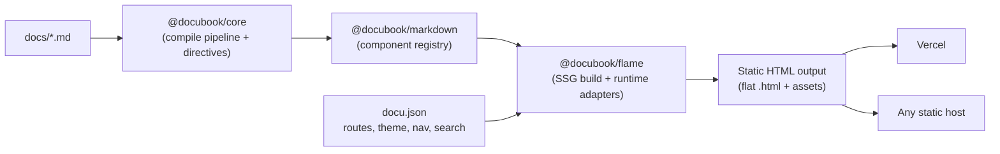
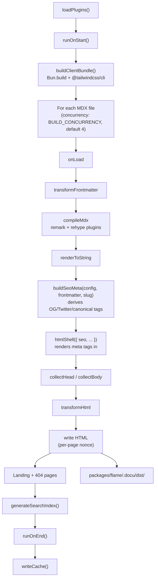

# DocuBook — Architecture

> System architecture overview for the DocuBook monorepo. Kept intentionally
> concise and version-free — package versions live in each `package.json`.
> The README shows the user-facing flow; this document covers the internals.

## System Purpose

**DocuBook** is a static site generator for documentation — **flame** compiles
markdown into flat `.html` files. Authoring is markdown-first: content is plain
markdown with directive-based components (`::` leaf, `:::` item, `::::` wrapper,
`:tooltip[...]`) — no authored JSX. `@docubook/core` provides the compile
pipeline (remark/rehype plugins, frontmatter, TOC, directives), and
`@docubook/markdown` provides the portable React components plus the directive
registry that renders them. Flame runs on Bun, Node.js, or Deno — the runtime
is only needed for the build toolchain and dev server; the output is pure
static HTML + assets.

**Scope boundaries:** content authoring and rendering only. No CMS, no user
authentication, no database. Content is file-based markdown, configuration is
declarative (`docu.json`), deployment is CI-driven.

## Package Inventory

| Package | Path | Role |
|---------|------|------|
| `@docubook/core` | `packages/core` | MDX compile pipeline — `serialize`, `MDXRemote`, pre/post-process, default remark/rehype plugins, frontmatter + TOC extraction, and the directive plugin `remarkDirectiveToMdx`. Absorbed `@docubook/mdx-remote`, renamed `mdx-compiler` (MPL-2.0). Pure TypeScript, no React dependency. |
| `@docubook/markdown` | `packages/markdown` | Portable React MDX components (Accordion, Tabs, CodeBlock, Callout, Card, Tree, Image, Link, Stepper, Table, Mermaid, Tooltip, Youtube) + `createMdxComponents()` registry for directives. Interactive components carry a `"use client"` banner. Renamed from `@docubook/mdx-content`. |
| `@docubook/flame` | `packages/flame` | SSG framework — incremental build, hook-based plugin system, eval-free island hydration, dev server with HMR, search index. Runtime adapters (Bun/Node/Deno) are built in under `.docu/node/runtime/`. Builds the production docs site (docubook.pro). |
| `@docubook/themes-colors` | `packages/themes-colors` | Theme color presets (default, freshlime, coffee) — CSS variables per light/dark mode plus color utilities (`hexToHsl`, `relativeLuminance`, `contrastRatio`, `getContrastingForeground`). Consumed by flame via `docu.json → theme.colors`. |
| `@docubook/ui-react` | `packages/ui-react` | DaisyUI + Tailwind CSS React primitives (Input, Modal, Dropdown, Drawer, Collapse, Toggle, ThemeController, Navbar, Breadcrumbs, Pagination, Kbd). Renamed from `@docubook/ui/react` (path and name). ESM + CJS. |

**Deprecated aliases** — `@docubook/mdx-content` (→ `markdown`),
`@docubook/mdx-remote` (→ `core`), `@docubook/runt` (→ flame),
`@docubook/ui/react` (→ `ui-react`). All stay published so existing users keep
resolving them.

### Monorepo Infrastructure

- **pnpm workspaces** — strict dependency resolution; `react`, `react-dom`, their
  types, and other shared deps (`esbuild`, `postcss`, `@sentry/bun`, etc.) are
  force-pinned via `overrides` in root `pnpm-workspace.yaml`. Also declares
  `allowBuilds` for native modules (`esbuild`, `sharp`, `bun`, etc.).
- **Turborepo** — orchestrates `build`, `lint`, `typecheck`, `test` with
  content-hash caching.
- **Changesets** — independent versioning per published package.
- **Husky + commitlint** — conventional commits enforced on commit and push
  (see [CONTRIBUTING.md](./CONTRIBUTING.md)).
- **GitHub Actions** — matrix CI: lint, typecheck, build, test. Bun is used
  for flame builds; pnpm with `--frozen-lockfile` everywhere else.

## Data Flow

```mermaid
flowchart LR
    A["docs/*.md"] --> B["@docubook/core<br/>(compile pipeline + directives)"]
    B --> C["@docubook/markdown<br/>(component registry)"]
    C --> D["@docubook/flame<br/>(SSG build + runtime adapters)"]

    E["docu.json<br/>routes, theme, nav, search"] --> D

    D --> F["Static HTML output<br/>(flat .html + assets)"]
    F --> G["Vercel"]
    F --> H["Any static host"]
```

### Build Pipeline

`packages/flame/.docu/node/build.impl.ts` (shared logic, invoked by runtime-specific entry points `build.ts` / `build.node.ts` / `build.deno.ts`):

```mermaid
flowchart TD
    Start["loadPlugins()"] --> OnStart["runOnStart()"]
    OnStart --> Bundle["buildClientBundle()<br/>Bun.build + @tailwindcss/cli"]

    Bundle --> Loop["For each MDX file<br/>(concurrency: BUILD_CONCURRENCY, default 4)"]

    Loop --> Load["onLoad"]
    Load --> FM["transformFrontmatter"]
    FM --> Compile["compileMdx<br/>remark + rehype plugins"]
    Compile --> Render["renderToString"]
    Render --> BuildSeo["buildSeoMeta(config, frontmatter, slug)<br/>derives OG/Twitter/canonical tags"]
    BuildSeo --> HtmlShell["htmlShell({ seo, ... })<br/>renders meta tags in <head>"]
    HtmlShell --> Collect["collectHead / collectBody"]
    Collect --> Transform["transformHtml"]
    Transform --> Write["write HTML<br/>(per-page nonce)"]

    Write --> Next["Landing + 404 pages"]
    Next --> Search["generateSearchIndex()"]
    Search --> OnEnd["runOnEnd()"]
    OnEnd --> Cache["writeCache()"]

    Write --> Output["packages/flame/.docu/dist/"]
```

Output: landing `index.html`, `404.html`, and pages as flat `docs/<slug>.html`
files with extensionless internal links (static hosts need `cleanUrls`-style
rewriting).

Incremental builds use per-file SHA-256 hashes in `build-cache.json` to skip
unchanged pages; mdx-manifest keys are sorted so the bundle hash is stable —
no-change builds skip all pages, and a single-file edit rebuilds exactly one.
The dev server memoizes MDX compile by (path, mtime).

The client bundle is built as a single entry (`splitting` disabled in both the
Bun and esbuild bundlers). The one output (`client-[hash].js`) is referenced
from HTML via a single `<script type="module">` with a matching `<link
rel="modulepreload">`. All modules, including heavy ones like `mermaid`, are
inlined into the entry so any page is one fetch with zero waterfall; client-side
lazy rendering is deferred via `IntersectionObserver` rather than runtime chunk
fetching. Hydration is eval-free: per-page compiled MDX is served as real ESM
modules (`mdx-module:` virtual namespace, imported by the bundled
`mdx-manifest`) — no `new Function(compiledSource)`. daisyUI is configured via
`@plugin "daisyui"` with only the `light` and `dark` themes to avoid emitting
all ~35 built-in themes.

## Deployment

The production docs site is built by flame and deployed to Vercel as static
output. Root `vercel.json` is the source of truth: it sets `"framework": null`
(forces the static preset), builds with `turbo build --filter=@docubook/flame...`,
installs with `pnpm install --filter=@docubook/flame...`, serves
`packages/flame/.docu/dist` with `cleanUrls`, and injects security headers
(CSP, HSTS, X-Frame-Options, X-Content-Type-Options, Referrer-Policy,
Permissions-Policy). An `ignoreCommand` skips re-deploys for non-production
Vercel environments.

The CSP applied by the serving layer is `script-src 'self' 'unsafe-inline'`:
`'unsafe-inline'` covers the blocking theme-init script injected per page.
Hydration is eval-free, so `'unsafe-eval'` is not needed anywhere. Static HTML
carries per-page nonces but no CSP meta tag — CSP always comes from the serving
layer (dev/preview server headers or `vercel.json` in production).

Hashed assets under `/assets/*` (bundles, CSS) are served with
`Cache-Control: public, max-age=86400, immutable` — `vercel.json` sets this for
the Vercel deploy, and `flame deploy` writes a `_headers` file into the output
for Netlify/Cloudflare Pages (GitHub Pages ignores it; its CDN handles caching
separately). The OG image (`/docs/assets/images/og.png`) gets `max-age=31536000`.

## Key Decisions

Condensed from the retired ADRs — these commitments are still in force:

1. **Monorepo with pnpm + Turborepo + Changesets.** Strict dependency
   isolation, cached builds, independent package versioning. All contributors
   must use pnpm (pinned via `packageManager`).
2. **One shared MDX pipeline as `@docubook/core`.** A single plugin chain for
   every framework — bug fixes propagate via version bump; no per-framework
   drift. `@docubook/mdx-remote` was merged into core and renamed
   `mdx-compiler` (v2) — core is now the only compiler.
3. **`docu.json` as universal configuration.** Framework-agnostic JSON drives
   routes, navigation, theme, and search. Validated by
   `packages/flame/docu.schema.json` (a published artifact — editing it ships
   to npm and warrants a changeset).
4. **DaisyUI for flame UI components.** DaisyUI is CSS-only — minimal JS for
   static output. `@docubook/markdown` stays framework-agnostic (no DaisyUI
   dependency). `@docubook/ui-react` provides the base DaisyUI component
   primitives consumed by flame's internal components.
5. **Island hydration in flame — mixed strategy.** A single `mountIsland()`
   helper decides per-island: `hydrateRoot` when the container already has
   server-rendered children (TOC, theme toggle); `createRoot` (force mode) for
   sidebar, mobile bar, and MDX content where SSR output is discarded to avoid
   hydration mismatches.
6. **Theme persistence per rendering mode.** Flame sets a `dark` class on
   `documentElement` via a blocking inline script reading `localStorage`
   (prevents FOUC). Theme-reactive components must observe the class, not
   `matchMedia`.
7. **Incremental builds with content hashing.** SHA-256 per-file hashes in
   `build-cache.json` skip unchanged pages; sorted mdx-manifest keys keep the
   bundle hash stable across no-change builds; `--force`/`--clean` for manual
   rebuilds.
8. **Single Tailwind pipeline via `@tailwindcss/cli`.** Flame invokes
   `@tailwindcss/cli` directly (Bun has no PostCSS runtime); the Node/Deno path
   does the same through `hydrate.node.ts`. `postcss` is not a direct dependency
   of any active package — it appears only as a security-patched transitive dep
   in `pnpm-workspace.yaml` overrides.
9. **Flame plugin system — hook-based, zero-config.** `DocuBookPlugin`
   interface (`name` + `setup(build)`) with 10 hooks: `onStart`, `onEnd`,
   `onLoad`, `transformFrontmatter`, `transformHtml`, `injectHead`,
   `injectBody`, `remarkPlugins`, `rehypePlugins`, `handleRequest` (dev server,
   first `Response` wins). Sequential execution in registration order; no
   plugins means no behavior change. Implementation:
   `packages/flame/.docu/node/plugin.ts`.
10. **SEO meta tags from existing config — zero new deps, zero required config.**
    `buildSeoMeta()` in `packages/flame/.docu/node/seo.ts` derives
    `og:title`, `og:description`, `og:url`, `og:type`, `og:site_name`,
    `twitter:card`, and canonical link from `docuConfig` + per-page frontmatter.
    `og:image` falls back from `frontmatter.image` → `meta.ogImage` → undefined.
    Image resolution uses the standard URL constructor (Web API). The 404 page
    omits OG tags and emits `<meta name="robots" content="noindex,follow">`.
11. **Markdown-first authoring — directives, no authored JSX.** Content is
    plain markdown; components are expressed with `::` / `:::` / `::::`
    directives and the single inline exception `:tooltip[label]{tip="…"}`
    (other single-colon text stays literal for URL safety). Directives compile
    via `remarkDirectiveToMdx` in core; rendered through
    `@docubook/markdown`'s `createMdxComponents()` registry.
12. **Eval-free MDX hydration.** Per-page compiled MDX is bundled as static ESM
    modules (`mdx-module:` virtual namespace) instead of
    `new Function(compiledSource)`. This drops `'unsafe-eval'` from every CSP
    and keeps the static-HTML contract intact.
13. **Multi-runtime via duplication at the entry layer, not abstraction of Bun
    code.** The Bun entry files (`server.ts`, `build.ts`, `preview.ts`,
    `deploy.ts`) delegate to shared `*.impl.ts` files. Node/Deno get parallel
    entries (`*.node.ts` / `*.deno.ts`) that swap only the Bun-coupled leaves:
    `html.shared.ts` (full HTML shell using pure `escapeHtml()` instead of
    `Bun.escapeHTML()`), `git.ts` (`child_process`), `hydrate.node.ts` (esbuild
    client bundling). Non-protected shared modules (`server-routes.ts`, `mdx.ts`)
    use `node:` APIs, which Bun runs natively. HTTP serving goes through the
    built-in adapters in `.docu/node/runtime/` (absorbed from `@docubook/runt`).
    Because Node cannot import `.tsx` and Deno does not execute TypeScript
    inside npm packages, `bin/compile-lib.mjs` bundles the Node/Deno entries to
    plain ESM in `.docu/lib/` at publish time; the CLI (`bin/cli.js`) detects
    the runtime (`FLAME_RUNTIME` env override → `process.execPath` deno check →
    `Bun` global → `Deno` global → node) and routes Bun to `.docu/node/*.ts`,
    others to `.docu/lib/*.js`.

## Testing

- Vitest per package: `cd packages/<name> && pnpm test`.
- Core: pure MDX compilation, directive parsing. Markdown: component rendering
  with `@testing-library/react` (incl. Mermaid fullscreen controls). Flame:
  build pipeline, server, plugin system, runtime adapters
  (suites in `packages/flame/.docu/__tests__/`). `@docubook/ui-react`:
  component rendering with `@testing-library/react`.
- Flame suites import `@docubook/core` — build it first:
  `npx turbo run build --filter=@docubook/core`.

## Trade-offs & Limitations

| Limitation | Impact | Mitigation |
|-----------|--------|------------|
| No dynamic content — markdown files only, no database/CMS | No user-generated content or real-time updates | Acceptable for documentation |
| Bun-only code paths duplicated for Node/Deno (entry layer) | Fixes to Bun entries may need mirroring in `*.impl.ts` counterparts | Duplication is confined to thin entries + three leaf modules; shared logic lives in neutral modules |
| `unsafe-inline` in serving CSP | Weakens CSP against XSS | Required by the blocking theme-init script; eval-free hydration already removed the `unsafe-eval` escape hatch; all other CSP directives stay strict |
| Directive-only authoring — no authored JSX | Components limited to the built-in directive set | `@docubook/markdown` registry is extensible programmatically via `createMdxComponents()` |
| Single `docu.json` config — no dynamic route generation | Routes cannot come from external APIs | Covers documentation use cases |
