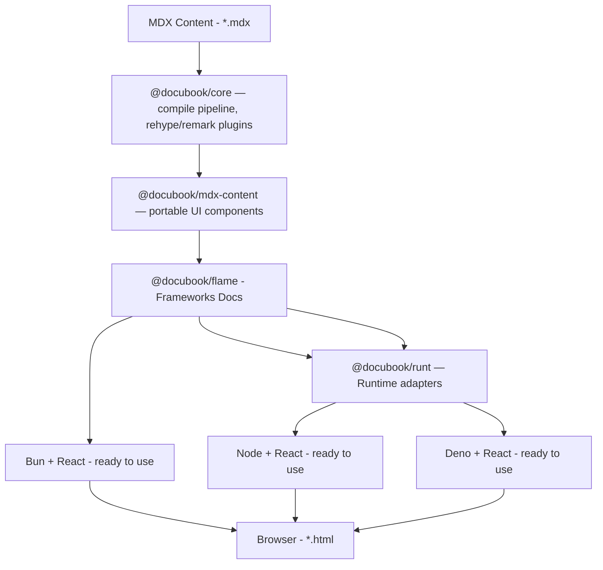

<p align="center">
  
</p>
<h1 align="center" style="font-size: 32px;">
  DocuBook
</h1>
<h3 align="center" style="font-size: 20px;">
  An open-source alternative to Mintlify or GitBook. Write documentation in MDX with your favourite UI library. The toolchain runs on Bun, Node.js, or Deno — output is flat static HTML, no server required.
</h3>

[](https://www.npmjs.com/package/@docubook/flame)
[](https://www.npmjs.com/package/@docubook/flame)
[](https://github.com/DocuBook/docubook/actions/workflows/ci.yml)
[](https://github.com/DocuBook/docubook/blob/main/LICENSE)

## Architecture

DocuBook is a **static site generator for documentation**. The core pipeline compiles MDX into flat `.html` files. The runtime (Bun, Node.js, Deno) is only needed for the build toolchain and local dev server; the final output is pure static HTML + assets — deploy to any CDN or static host.



## Packages

|                                     Package                                      |                                                                    Description                                                                    |
| -------------------------------------------------------------------------------- | ------------------------------------------------------------------------------------------------------------------------------------------------- |
| **[@docubook/core](https://www.npmjs.com/package/@docubook/core)**               | Shared MDX compile pipeline, rehype/remark plugins, and markdown utilities.                                                                       |
| **[@docubook/mdx-content](https://www.npmjs.com/package/@docubook/mdx-content)** | Portable MDX components (Mermaid, CodeBlock, Tabs, etc.) with framework-agnostic adapters.                                                        |
| **[@docubook/flame](https://www.npmjs.com/package/@docubook/flame)**             | The runtime layer — a React + MDX framework that bridges compiled content to the browser. Runs on Bun, Node.js, and Deno.                         |
| **[@docubook/runt](https://www.npmjs.com/package/@docubook/runt)**               | Runtime HTTP server adapters (Bun, Node.js, Deno) behind a single `RuntimeAdapter` interface.                                                     |
| **[@docubook/mdx-remote](https://www.npmjs.com/package/@docubook/mdx-remote)**   | Runtime MDX compilation and rendering — a rewrite of next-mdx-remote for DocuBook.                                                                |

## Runtimes

The runtime is only needed for the build toolchain and local dev server. The output is flat static HTML — deploy to any CDN or static host (Vercel, Netlify, Cloudflare Pages, GitHub Pages, S3, etc.).

| Runtime  | UI Library |      Status      |                    Recipe                    |
| -------- | ---------- | ---------------- | -------------------------------------------- |
| **Bun**  | React      | ✅ Available      | `bun add @docubook/flame`                    |
| **Node** | React      | ✅ Available      | `npm install @docubook/flame`                |
| **Deno** | React      | ✅ Available      | `deno run -A npm:@docubook/flame init`       |
| **Bun**  | Vue        | 🔮 Planned        | —                                            |
| **Node** | Vue        | 🔮 Planned        | —                                            |
| **Deno** | Vue        | 🔮 Planned        | —                                            |

## Prerequisites

Choose **one** runtime to get started.

### Bun (≥ 1.1.0)

```bash
# Install: https://bun.sh
curl -fsSL https://bun.sh/install | bash
# or: npm install -g bun

bun --version
```

### Node.js (≥ 20.11)

```bash
# Install: https://nodejs.org
# or: https://github.com/nvm-sh/nvm#installing-and-updating

node --version
```

### Deno (≥ 2.x)

```bash
# Install: https://deno.com
curl -fsSL https://deno.land/install.sh | sh
# or (macOS): brew install deno

deno --version
```

---

## Installation

### Bun + React

```bash
mkdir my-docs && cd my-docs
bun add @docubook/flame
bunx flame init
bun run dev
```

### Node.js + React (Node >= 20.11)

```bash
mkdir my-docs && cd my-docs
npm install @docubook/flame
npx flame init
npm run dev
```

### Deno + React

```bash
mkdir my-docs && cd my-docs
deno run -A npm:@docubook/flame init
deno task dev
```

## Contributing

<!-- prettier-ignore -->
> [!NOTE]
> We are very open to all your contributions, no matter how small your contribution is, it will certainly be part of the development of this project.
> 
> Please read: [CONTRIBUTING.md](CONTRIBUTING.md)

## Workspace

<!-- prettier-ignore -->
> [!IMPORTANT]
> This repository uses a monorepo setup powered by pnpm workspaces and Turborepo to manage apps and packages in a single workspace.
>
> For development workflow:
> - Vitest provides fast unit testing with native ESM and TypeScript support
> - Changesets handles package versioning and release management
> - Husky runs automatic linting and formatting before commits
> - commitlint ensures commit messages follow the Conventional Commits format consistently
>
> This setup helps keep the codebase organized, maintainable, and contributor-friendly.
