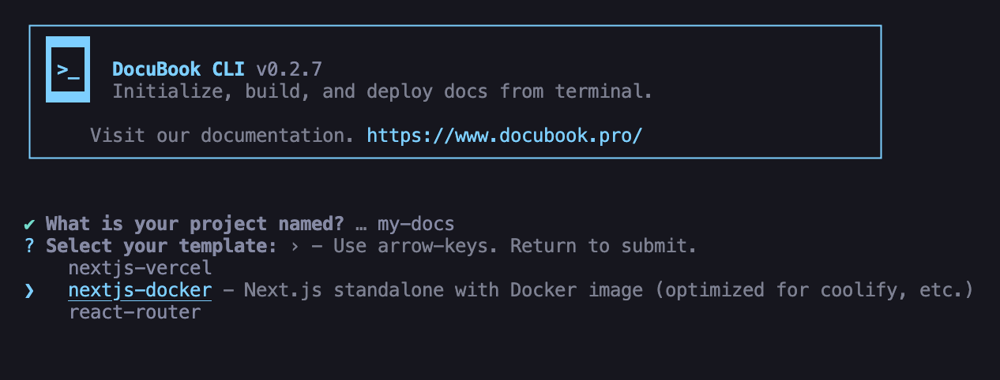

# DocuBook

**DocuBook** is a documentation web project designed to provide a simple and user-friendly interface
for accessing various types of documentation. This site is crafted for developers and teams who need
quick access to references, guides, and essential documents.

## Features

- **Easy Navigation**: Simple layout for quick navigation between pages.
- **Quick Search**: Easily find documentation using a search function.
- **Responsive Theme**: Responsive design optimized for devices ranging from desktops to mobile.
- **Markdown Content**: Support for markdown-based documents.
- **SEO Friendly**: Optimized structure for search visibility, enhancing accessibility on search
  engines.

## Installation

```bash
npx @docubook/cli@latest
```

#### command output



## Development Setup

This monorepo uses **pnpm workspaces** and includes automated git hooks for consistent development
workflow.

### Requirements

- **Node.js** >= 20.0.0
- **pnpm** >= 11.0.0

### Installing Dependencies

```bash
pnpm install
```

### Package Manager

This project is configured to use **pnpm** as the package manager. Using other package managers may
cause workspace resolution issues.

If you have `corepack` enabled, pnpm will be automatically selected:

```bash
corepack enable
corepack prepare pnpm@11.0.0 --activate
```

### Git Hooks (Husky)

Git hooks are automatically set up via Husky during `pnpm install` (via the `prepare` script). These
hooks enforce code quality standards on every commit.

#### Pre-commit Hook

Runs lint-staged to validate and format staged files:

- **JavaScript/TypeScript/JSX/TSX/MDX**: ESLint + Prettier
- **JSON/MD/MDX**: Prettier check

#### Commit-msg Hook

Validates commit messages using **Commitlint** with
[Conventional Commits](https://www.conventionalcommits.org/) format.

### Commit Message Convention

This project follows the **Conventional Commits** specification. Commit messages must follow this
format:

```
<type>(<scope>): <subject>
```

#### Types

| Type       | Description                                 |
| ---------- | ------------------------------------------- |
| `feat`     | New feature                                 |
| `fix`      | Bug fix                                     |
| `docs`     | Documentation only changes                  |
| `style`    | Code style changes (formatting, semicolons) |
| `refactor` | Code refactoring without feature/fix        |
| `perf`     | Performance improvements                    |
| `test`     | Adding or modifying tests                   |
| `build`    | Build system or dependency changes          |
| `ci`       | CI configuration changes                    |
| `chore`    | Other changes that don't modify src         |
| `revert`   | Reverting a previous commit                 |

#### Scopes

The `scope` is optional but recommended. Common scopes:

| Scope         | Description               |
| ------------- | ------------------------- |
| `app`         | Main application          |
| `packages`    | Package changes (general) |
| `cli`         | CLI package               |
| `core`        | Core package              |
| `mdx-content` | MDX content package       |
| `docs`        | Documentation             |
| `configs`     | Configuration files       |
| `scripts`     | Build/scripts             |

#### Examples

```bash
feat(cli): add new command
fix(core): resolve template rendering issue
docs: update API documentation
refactor(app): simplify navigation logic
chore: update dependencies
```

### Interactive Commit (czg)

For an interactive commit prompt, use:

```bash
pnpm commit
```

This provides a guided interface for writing properly formatted commit messages.

### Versioning & Release Workflow

This monorepo uses [Changesets](https://github.com/changesets/changesets) to manage versioning and
releases for all packages (`@docubook/cli`, `@docubook/core`, `@docubook/mdx-content`).

### Managed Packages

| Location               | Package                                                                                                           |
| ---------------------- | ----------------------------------------------------------------------------------------------------------------- |
| `packages/cli`         | [](https://www.npmjs.com/package/@docubook/cli)                 |
| `packages/core`        | [](https://www.npmjs.com/package/@docubook/core)               |
| `packages/mdx-content` | [](https://www.npmjs.com/package/@docubook/mdx-content) |

### Version Bump Guide

Choose the bump type based on the nature of the change:

| Type    | When to use                                             | Version example   |
| ------- | ------------------------------------------------------- | ----------------- |
| `patch` | Bug fixes and small changes that do not affect the API  | `1.0.0` → `1.0.1` |
| `minor` | New features that are backward-compatible               | `1.0.0` → `1.1.0` |
| `major` | Breaking changes — API is no longer backward-compatible | `1.0.0` → `2.0.0` |

---

<details>
<summary>Workflow: Patch Release (bug fix)</summary>

```bash
# 1. Create a changeset — select the affected package(s) and choose "patch"
pnpm changeset

# 2. Commit the generated changeset
git add .changeset/
git commit -m "chore: add changeset for patch fix"

# 3. Apply version bumps and generate CHANGELOG
pnpm package

# 4. Commit the version bump
git add .
git commit -m "chore: release patch"

# 5. Push your branch and open a Pull Request
git push <branch-name>
```

</details>

---

<details>
<summary>Workflow: Minor Release (new feature)</summary>

```bash
# 1. Create a changeset — select the affected package(s) and choose "minor"
pnpm changeset

# 2. Commit the generated changeset
git add .changeset/
git commit -m "chore: add changeset for new feature"

# 3. Apply version bumps and generate CHANGELOG
pnpm package

# 4. Commit the version bump
git add .
git commit -m "chore: release minor"

# 5. Push your branch and open a Pull Request
git push <branch-name>
```

</details>

---

<details>
<summary>Workflow: Major Release (breaking change)</summary>

```bash
# 1. Create a changeset — select the affected package(s) and choose "major"
pnpm changeset

# 2. Commit the generated changeset
git add .changeset/
git commit -m "chore: add changeset for breaking change"

# 3. Apply version bumps and generate CHANGELOG
pnpm package

# 4. Commit the version bump
git add .
git commit -m "chore: release major"

# 5. Push your branch and open a Pull Request
git push <branch-name>
```

</details>
