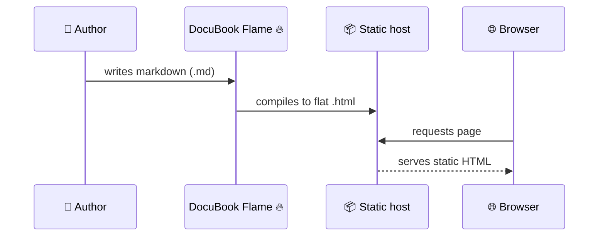

<p align="center">
  
</p>

<p align="center">
  <a href="https://github.com/DocuBook/docubook/releases"></a>
  <a href="https://github.com/DocuBook/docubook/actions"></a>
  <a href="https://www.npmjs.com/package/@docubook/flame"></a>
</p>

> An open-source alternative to Mintlify or GitBook. Write documentation in markdown and directives.
>
> The toolchain runs on Bun, Node.js, or Deno — output is flat static HTML, no server required.

## Architecture


```mermaid
sequenceDiagram
    participant Author as 📝 Author
    participant Flame as DocuBook Flame 🔥
    participant Host as 📦 Static host
    participant Browser as 🌐 Browser

    Author->>Flame: writes markdown (.md)
    Flame->>Host: compiles to flat .html
    Browser->>Host: requests page
    Host-->>Browser: serves static HTML
```

## Quick Start

#### Prerequisite

<!-- prettier-ignore -->
> [!WARNING]
> Verify the runtime is installed: `bun --version`, `node --version`, or `deno --version`.

Create the project directory, then run the flow for your runtime:

```bash
mkdir my-docs && cd my-docs
```

### Bun (≥ 1.1.0) — [install](https://bun.sh)

```bash
bun add @docubook/flame
bunx flame init
bun run dev
```

### Node.js (≥ 20.11) — [install](https://nodejs.org)

```bash
npm install @docubook/flame
npx flame init
npm run dev
```

### Deno (≥ 2.x) — [install](https://deno.com)

```bash
deno run -A npm:@docubook/flame init
deno task dev
```

## Contributing

<!-- prettier-ignore -->
> [!NOTE]
> We are very open to all your contributions, no matter how small your contribution is, it will certainly be part of the development of this project.
> 
> Please read: [CONTRIBUTING.md](CONTRIBUTING.md)

## Workspace

<!-- prettier-ignore -->
> [!IMPORTANT]
> This repository uses a monorepo setup powered by pnpm workspaces and Turborepo to manage apps and packages in a single workspace.
>
> For development workflow:
> - Vitest provides fast unit testing with native ESM and TypeScript support
> - Changesets handles package versioning and release management
> - Husky runs automatic linting and formatting before commits
> - commitlint ensures commit messages follow the Conventional Commits format consistently
>
> This setup helps keep the codebase organized, maintainable, and contributor-friendly.
