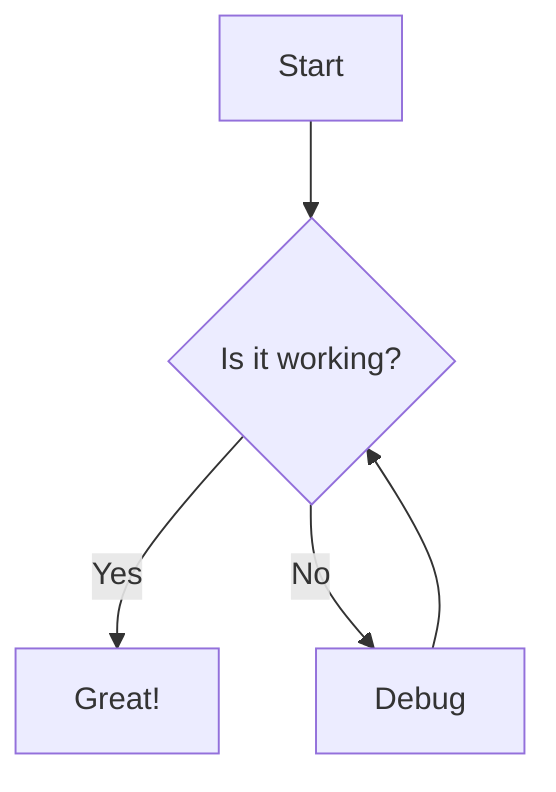
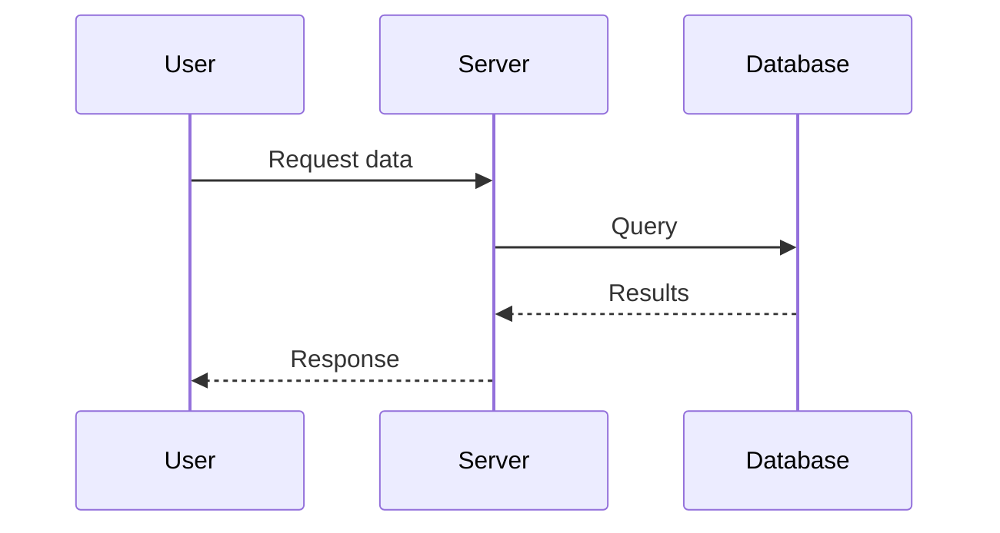
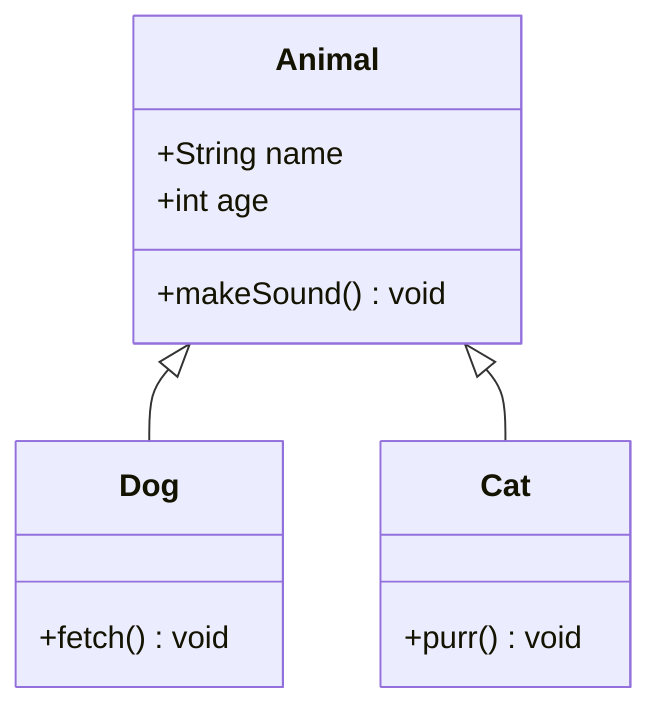
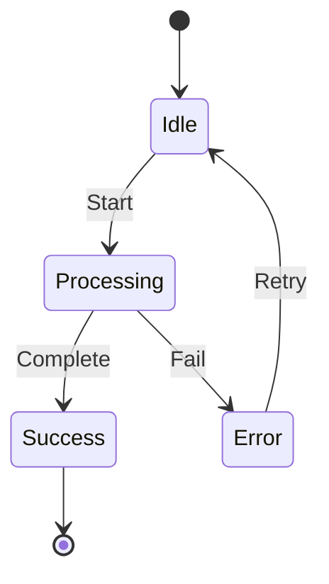
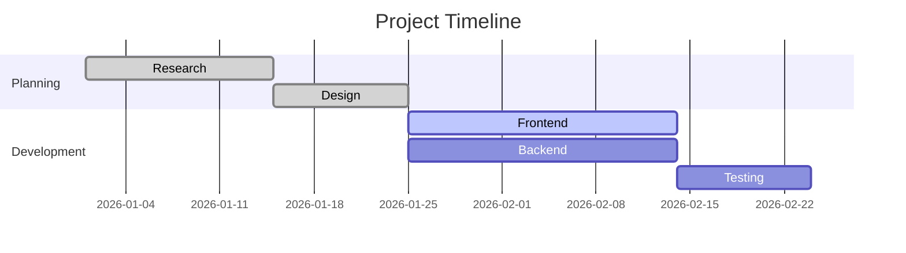
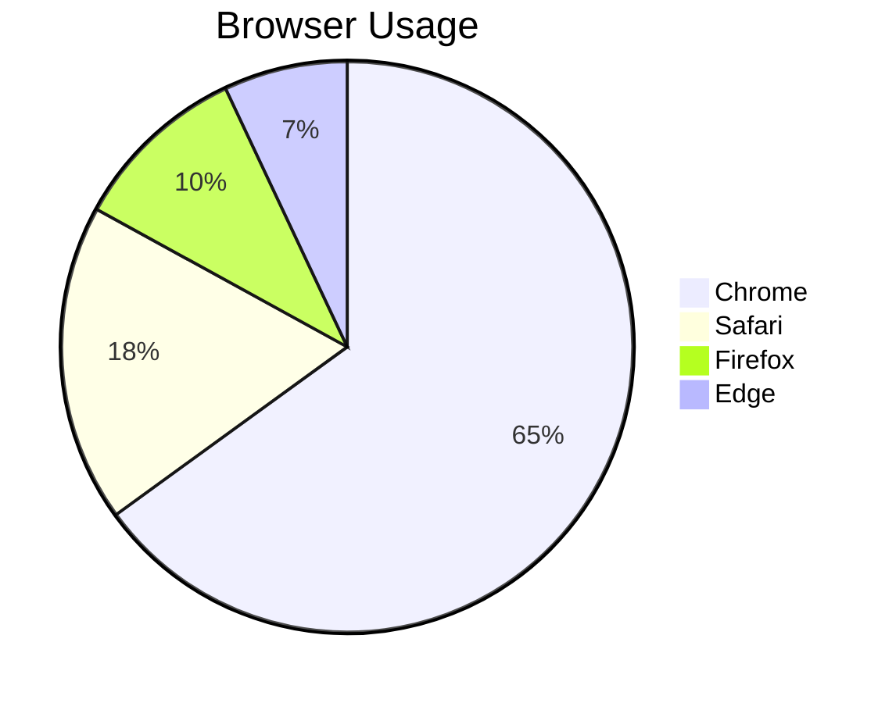
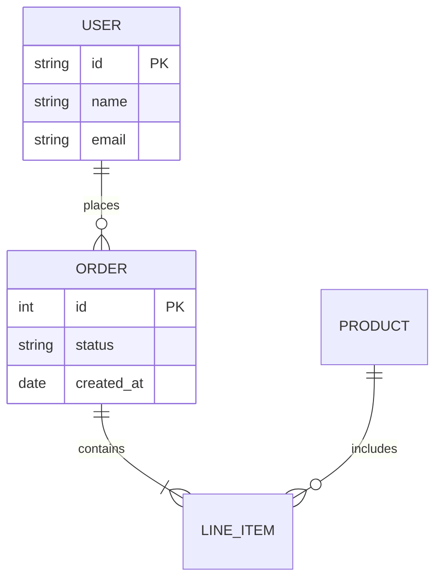

Mermaid lets you create diagrams and visualizations using plain text. DocuBook renders Mermaid diagrams natively inside MDX — just write a fenced code block with the `mermaid` language identifier.

For the full list of diagram types and syntax reference, see the [official Mermaid documentation](https://mermaid.js.org/).

## Diagram Types

| **Diagram Type** | **Identifier** | **Mermaid Docs** |
| ---------------- | -------------- | ---------------- |
| Flowchart | `graph TD` / `flowchart TD` | [Flowchart](https://mermaid.js.org/syntax/flowchart.html) |
| Sequence Diagram | `sequenceDiagram` | [Sequence Diagram](https://mermaid.js.org/syntax/sequenceDiagram.html) |
| Class Diagram | `classDiagram` | [Class Diagram](https://mermaid.js.org/syntax/classDiagram.html) |
| State Diagram | `stateDiagram-v2` | [State Diagram](https://mermaid.js.org/syntax/stateDiagram.html) |
| Gantt Chart | `gantt` | [Gantt](https://mermaid.js.org/syntax/gantt.html) |
| Pie Chart | `pie` | [Pie Chart](https://mermaid.js.org/syntax/pie.html) |
| ER Diagram | `erDiagram` | [Entity Relationship](https://mermaid.js.org/syntax/entityRelationshipDiagram.html) |

## Flowchart



## Sequence Diagram



## Class Diagram



## State Diagram



## Gantt Chart



## Pie Chart



## ER Diagram



## Pan and Zoom

Every rendered diagram gets a GFM-style control cluster in the bottom-right corner, so large diagrams stay explorable without mouse-drag interaction:

- **Arrow buttons** — pan the diagram up, down, left, or right in fixed steps
- **Zoom in / zoom out** — scale the diagram between 0.4× and 4×
- **Reset** — restore the original position and scale
- **Full screen** — open the diagram in a lightbox overlay; close it with the same button or <kbd>Escape</kbd>

The diagram container is keyboard accessible: focus it with <kbd>Tab</kbd>, then pan with the arrow keys, zoom with <kbd>+</kbd> / <kbd>-</kbd>, and reset with <kbd>0</kbd>.

Set `panZoom={false}` on the prop-based syntax to disable the controls.

## Props

When using the prop-based syntax (`<Mermaid chart="...">`) instead of fenced code blocks:

|    Prop     |  Type   | Default |                   Description                   |
| ----------- | ------- | ------- | ----------------------------------------------- |
| `chart`     | string  | —       | Mermaid diagram definition (required)           |
| `id`        | string  | —       | Custom DOM id (auto-generated if omitted)       |
| `className` | string  | —       | Additional CSS class on the container element   |
| `panZoom`   | boolean | `true`  | Show pan/zoom controls once the diagram renders |

## Output Markdown

Primary syntax — fenced code block:

````markdown

````

Escape hatch — prop syntax (for programmatic use):

```markdown
<Mermaid chart="graph TD&#10;  A[Start] --> B{Is it working?}">
</Mermaid>
```

## Notes

- Diagrams are rendered **client-side**. During SSR, a `<pre class="mermaid">` placeholder is rendered instead.
- **Pan, zoom, and fullscreen**: Button-driven controls (GFM-style) appear once a diagram renders, including a fullscreen lightbox toggle; mouse drag and scroll-wheel zoom are intentionally not intercepted.
- **Theme synchronization**: The component automatically detects dark/light theme changes and re-renders diagrams.
- **Lazy loading**: Off-screen diagrams are only rendered when scrolled into view (200px margin).
- **Error fallback**: If a diagram has invalid Mermaid syntax, the raw code is shown with an error message.
- Per-diagram theme overrides can be set via `%%{init: {"theme": "forest"}}%%` directives inside the chart definition.
- All standard Mermaid diagram types are supported: `flowchart`, `sequenceDiagram`, `classDiagram`, `stateDiagram`, `gantt`, `pie`, `erDiagram`, `gitGraph`, `journey`, etc.
