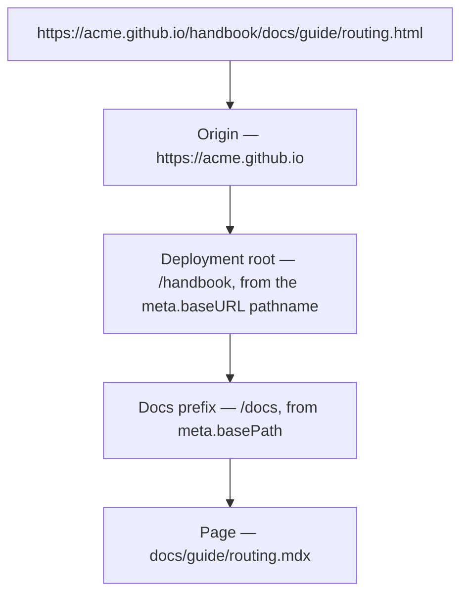

Flame always emits a flat `.html` build, but the URL shape it is served under is configurable. Two independent settings decide that shape, and mixing them up is the usual cause of broken assets after a move:

| Setting | Prefix it controls | Lives in | Example |
| ------- | ------------------ | -------- | ------- |
| `meta.basePath` | The docs prefix **inside** the build output | `docu.json` | `/docs` (default), `/handbook`, `""` |
| `meta.baseURL` | Origin **plus deployment root** — the path the host serves the dist under | `docu.json` | `https://book.acme.dev`, `https://acme.github.io/handbook` |



## Docs prefix

`meta.basePath` is where the docs site sits inside the dist **and** in the URL. It defaults to `/docs`, so leaving it unset keeps the historical layout:

```json:docu.json
{
  "meta": {
    "title": "Acme Docs",
    "baseURL": "https://book.acme.dev",
    "basePath": "/handbook"
  }
}
```

| Value | Docs served at | Pages written to |
| ----- | -------------- | ---------------- |
| `/docs` (default) | `https://host/docs/getting-started.html` | `.docu/dist/docs/getting-started.html` |
| `/handbook` | `https://host/handbook/getting-started.html` | `.docu/dist/handbook/getting-started.html` |
| `""` or `"/"` | `https://host/getting-started.html` | `.docu/dist/getting-started.html` |

The prefix is applied everywhere a docs URL is produced — the dev server and static routing, internal links and asset paths in rendered pages, canonical and Open Graph URLs, the search index, and the nginx config generated by `flame deploy --docker`. It is also part of the build cache key, so changing it rebuilds every page instead of reusing HTML that points at the old prefix.

You do not have to rewrite your content when you change it: links authored as `/docs/guide/routing` are re-based onto the configured prefix, so one `docu.json` works at `/docs`, at `/handbook`, and at the deployment root. See [Formatting](/docs/getting-started/formatting) for the link rules.

## Deployment root

`meta.baseURL` is the **origin plus the deployment root** — the base a browser prepends to every root-absolute path. Its pathname is the *deployment path*: empty when the origin serves the dist at `/`, `/repo` when the host publishes the artifact under a path.

```json:docu.json
{
  "meta": {
    "title": "Acme Docs",
    "baseURL": "https://acme.github.io/handbook"
  }
}
```

Only root-absolute references need it — the `404.html` fallback's bundle assets and the search index records, which are clicked directly from the modal and cannot be expressed as a relative climb. It is also the base canonical and Open Graph URLs are resolved against. Everything else already lines up, because pages and assets share the deployment root.

:::warning{title="Do not repeat the docs prefix"}
`baseURL` stops at the deployment root; `basePath` adds the docs prefix on top. With `basePath: "/docs"` and `baseURL: "https://acme.github.io/handbook"`, canonical URLs become `https://acme.github.io/handbook/docs/…`. Writing the prefix into both produces `/handbook/docs/docs/…`.
:::

## Common setups

| Hosting | `meta.baseURL` | `meta.basePath` | Docs URL |
| ------- | -------------- | --------------- | -------- |
| Default local/production | `https://book.acme.dev` | omit (defaults to `/docs`) | `https://book.acme.dev/docs/…` |
| Custom prefix on your own domain | `https://book.acme.dev` | `/handbook` | `https://book.acme.dev/handbook/…` |
| GitHub Pages project site | `https://acme.github.io/handbook` | omit (defaults to `/docs`) | `https://acme.github.io/handbook/docs/…` |
| GitHub Pages project site, docs at the artifact root | `https://acme.github.io/handbook` | `""` | `https://acme.github.io/handbook/…` |
| GitHub Pages user/org site | `https://acme.github.io` | omit (defaults to `/docs`) | `https://acme.github.io/docs/…` |

For a **project site**, `baseURL` must include the repository segment — that is the path GitHub Pages serves the artifact under. Without it, the search index and the 404 fallback point at the origin root and return 404.

## Root deployment

Setting `"basePath": ""` serves the docs at the deployment root. Two details follow from that:

- **Pages move to the dist root.** `docs/getting-started.mdx` → `.docu/dist/getting-started.html`, and the URL is `/getting-started.html` under the deployment root.
- **The landing page owns `/`.** The docs index (`docs/index.mdx`) is not written — it would collide with the generated landing page — and `index.html` left over from a previous build is removed. Author links as usual: `/docs/guide/routing` collapses to `/guide/routing`.

The docs index is optional in every setup: when `docs/index.mdx` (or `docs/index.md`) is absent, the build simply produces no docs index page — the landing page always owns `/`.

:::info{title="Docker at the root"}
With an empty prefix, the two asset trees — hash-named bundles at `/assets/` and content assets copied from `docs/assets/` — land on the same path, and nginx rejects a duplicate `location /assets/` block. The generated `nginx.conf` therefore omits the content-assets cache block (7d) and lets the immutable bundle rules win; the files are still served. The same applies to a prefix containing characters nginx cannot use in a `location` name — the build logs a warning and drops the block.
:::

## Canonical form

The prefix is both a URL path and an output directory, so it is canonicalized to lowercase segments with no trailing slash, no dot segments, and nothing that needs percent-encoding. The schema describes the accepted shape:

```json
{
  "pattern": "^(|/|/[a-z0-9._~-]+(/[a-z0-9._~-]+)*)$",
  "maxLength": 128
}
```

Non-canonical values are still honored — Flame normalizes them and logs a warning naming the canonical value, so you can update `docu.json` and keep the editor quiet:

| Written | Resolved | Note |
| ------- | -------- | ---- |
| `/docs` | `/docs` | Canonical — no warning |
| `""`, `/`, `"///"` | `""` | Deployment root — no warning |
| `/Docs` | `/docs` | Non-lowercase letters |
| `/docs me` | `/docs-me` | Whitespace becomes a dash |
| `/docs/two words` | `/docs/two-words` | Whitespace becomes a dash |
| `/docs//guide` | `/docs/guide` | Doubled separator collapsed |
| `/docs/../guide` | `/docs/guide` | Dot segment dropped |
| `/docs/€` | `/docs` | Unservable characters dropped |
| `123`, `null` | — | **Build error**: the value must be a string |

A non-string value is the only hard failure — it cannot be normalized. Everything else is reported and normalized at the start of `flame dev` and `flame build`, before any output is written.

## Verify

After a build, the prefix should show up consistently in each of these places:

| Check | Where to look |
| ----- | ------------- |
| Output layout | `.docu/dist/<prefix>/…` (or the dist root when the prefix is empty) |
| Generated links | View source of a built page — internal links carry the prefix and `.html` |
| Canonical URL | `<link rel="canonical">` in a built page |
| Search index | Open the search modal and confirm a result's target URL |
| 404 fallback | `.docu/dist/404.html` — its bundle assets carry the deployment path |
| nginx (Docker) | The generated `nginx.conf` at the project root — the content-assets block matches the prefix |

:::info{title="Dev server"}
`flame dev` serves the docs under the configured prefix, so `/handbook/…` works locally too. The host's deployment path is not simulated in dev — it only exists in built output, where a host actually publishes the dist under a path.
:::
