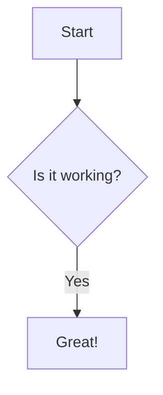

DocuBook content is authored in markdown. Three syntaxes coexist, and each
has a clear role:

| Syntax | Used for |
| ------ | -------- |
| **Common Markdown / GFM** | headings, bold, italic, lists, links, tables, images |
| **Fenced code** (`` ` ``) | code blocks, Mermaid diagrams — triple ```` ``` ```` by default; quad ````` ```` ````` only when the content itself contains triple backticks |
| **Directives** (`:` colon) | components — leaves (`::`), items (`:::`), wrappers (`::::`) |

## Common Markdown (GFM)

Native markdown — no special syntax, styled by the framework automatically.

### Typography

````markdown
**Bold** - Bold text

_Italic_ - Italic text

~strikethrough~ - strikethrough text

> This is a blockquote

`inline code`

[Create internal Link](/docs)

[Create external Link](https://docubook.pro)
````

### Lists

````markdown
- one line
- two line
- three line
    - sub three line
---
1. number one
2. number two
3. number three
````

### Task lists (checkboxes)

GFM task lists — `- [ ]` unchecked, `- [x]` checked. A task item is just a
list item starting with a checkbox marker:

````markdown
- [x] done item
- [ ] pending item
- [ ] another pending item
````

### Paragraph breaks

````markdown
This is the first paragraph.

This is the second paragraph, separated by a blank line.
````

Links, tables, and images use their standard GFM syntax — the framework
styles them; no component syntax needed.

## Fenced Code

Fenced code blocks are delimited by backticks and render as code — the
content is **never** parsed as markdown or directives.

### Triple vs quad fences

| Fence | When to use |
| ----- | ----------- |
| ```` ``` ```` (triple) | **Default** — any code content without a triple-backtick sequence: TS, shell, JSON, `mermaid`, … |
| ````` ```` ````` (quad) | **Only when the content itself contains triple backticks** — documenting markdown/MDX or nesting a fenced example inside another |

The closing fence must repeat the **same number of backticks** as the opening
one. Inside a quad fence you can nest triple fences freely; inside a triple
fence a triple-backtick sequence would close the block early:

````markdown
```ts
// content with no backticks → triple fence is enough
const x = 1;
```
````

``````markdown
````markdown
```ts
// showing a fenced block inside a block → quad fence required
```
````
``````

````markdown
```ts
const greeting: string = "Hello, DocuBook!";
```
````

### Syntax highlighting

Use a language identifier to enable highlighting, optionally with a title
for the code header (`lang:filename`):

````markdown
```tsx:button.tsx
export function Button() {
  return <button>Click</button>;
}
```
````

### Mermaid diagrams

Mermaid uses the fenced convention (same as GitHub/GitLab) — no directive:

````markdown

````

## Directives

Directives are the DocuBook component syntax. Three colon counts, each with
a distinct role — and **every directive that opens must close**.

### Double colon (`::`) — leaf

Self-closing components **without children**. No closing marker needed —
the directive is complete on its line.

```
::youtube{videoId="OPM2t54T-Vo"}
```

#### Inline tooltip — the one single-colon exception

Tooltips are the one component that reads naturally **inside a paragraph**.
`:tooltip` is the only inline (single-colon) directive; every other single
colon stays literal text:

```
Common markdown here :tooltip[hover me]{tip="bubble text"} inline first.

Short form — the label is the trigger and the bubble:
:tooltip[just a bubble]
```

`[label]` is the visible trigger (dotted underline); `{tip="…"}` is the hover
bubble and defaults to the label. The bubble auto-positions itself — no
`side` prop needed.

### Triple colon (`:::`) — item

Components that **hold content**, one at a time: callouts, card, tab, step,
accordion. Open with `:::` and **always close with `:::`**

```md
:::card{title="Hello" icon="Cpu"}
This is the card content.
:::

:::tip{title="Heads up"}
Callout content.
:::

:::accordion{title="More info"}
Collapsible content.
:::
```

Items nest inside their plural wrapper — the wrapper is `::::`, the item
inside is `:::`

```md
::::tabs{className="pt-5 pb-1"}
:::tab{title="Bun"}
Install with Bun.
:::
:::tab{title="Node.js"}
Install with npm.
:::
::::
```

Callout variants: `:::tip`, `:::info`, `:::danger`, `:::warning`, `:::success`
— the only prop is `title` (optional, falls back to the variant label).

### Quad colon (`::::`) — wrapper

Wrappers that **contain other components**: tabs, accordions, steps, cards,
tree. Open with `::::` and **always close with `::::`**.

```md
::::tabs{className="pt-5 pb-1"}
:::tab{title="Bun"}
Install with Bun.
:::
:::tab{title="Node.js"}
Install with npm.
:::
::::
```

### Why you must always close

1. **Nothing gets trapped.** Without a close, a component swallows every
   sibling that follows it — including the next section. An explicit close
   bounds the component exactly, so content after it always belongs to the
   document, never to the component.

2. **Nesting is deterministic.** A container is closed by the first colon
   fence of equal length. `:::tab` inside `:::tabs` closes the wrapper — so
   wrappers use `::::` and items `:::` to nest unambiguously. Without the
   close marker, the parser cannot tell where an item ends.

3. **Mirrors fenced code.** Fenced code opens with ```` ``` ```` and closes
   with ```` ``` ```` — the same mental model. An unclosed code block is
   broken; an unclosed directive is broken the same way.

4. **Author intent is explicit.** Closing makes it clear to readers (and
   agents) exactly which content belongs to which component.

### ASCII tree

The File Tree component parses an ASCII tree — indent nested levels with the
`│` pipe character (leading spaces are stripped by the markdown parser).

```md
::::tree
src/
├─ App.tsx
└─ components/
│  ├─ Button.tsx
│  └─ Card.tsx
::::
```

## File extensions

`.mdx` and `.md` are treated identically — the pipeline parses markdown,
fenced code, and directives in both. The extension is purely a preference.

## No JSX tags in v2

**The JSX tag API is gone.** Authoring components with React tags like
`<Accordion>`, `<Card>`, or `<Tabs>` is **not supported in v2** — the
parser drops the tag and keeps only the text content. Components are
written exclusively with directives.

If you are migrating v1 content that uses JSX tags, use this mapping:

| v1 JSX tag | v2 directive |
| ---------- | ------------ |
| `<Card>` / `<Cards>` | `:::card` / `::::cards` |
| `<Tabs>` | `::::tabs` |
| `<Tab>` | `:::tab` |
| `<Accordion>` / `<Accordions>` | `:::accordion` / `::::accordions` |
| `<Steps>` / `<Step>` | `::::steps` / `:::step` |
| `<Note type="tip">` | `:::tip` |
| `<Files>` / `<Folder>` / `<File>` | `::::tree` (ASCII) |
| `<Youtube>` | `::youtube` |
| `<Tooltip>` | `:tooltip[label]{tip="…"}` |
| `<Mermaid>` | ` ```mermaid ` (fenced) |

Directives cover every component — see the [Components](/docs/components/accordion)
index for the full list.
