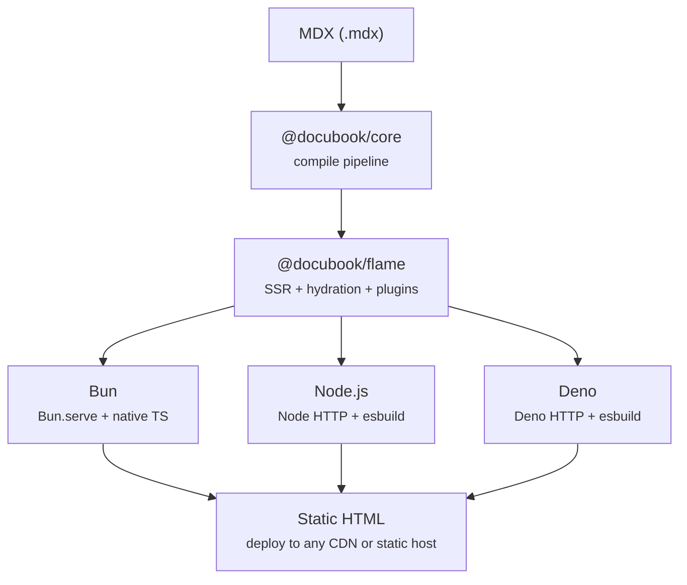

## Why Flame Exists

Building documentation sites often means wrestling with heavyweight frameworks, slow tooling, and complex configuration. Flame takes a different approach: **minimal, runtime-agnostic, and React-first**. It is designed to let you focus on writing content while providing a fast, developer-friendly foundation — whether you use Bun, Node.js, or Deno.

<Note title="Contribute">
  Want to contribute? Visit our [GitHub repository](https://github.com/DocuBook/docubook).
  Feature ideas, bug reports, and pull requests are welcome.
</Note>

## Overview

Flame is a lightweight runtime for building documentation websites using React, MDX, and filesystem-based routing. The toolchain runs on Bun, Node.js, or Deno — the final output is pure static HTML.

- **React-first** — JSX/TSX, hooks, component composition
- **MDX content** — write Markdown with embedded React components
- **Filesystem routing** — auto-discover pages from `docs/` folder
- **Lightweight SSR** — server-side rendering without a heavy framework
- **Client hydration** — interactive islands for sidebar, TOC, and MDX components
- **HMR** — instant reload on content changes during development
- **Static build** — pre-render all pages to static HTML for deployment
- **Built-in search** — full-text search index generated at build time
- **Plugin system** — extend the build pipeline and dev server with hooks
- **Config-driven themes** — switch presets or use custom colors via `docu.json`
- **Runtime-agnostic** — the same CLI, the same output, on Bun, Node.js, or Deno

## Technology Stack

- **Runtime** — Bun, Node.js >= 20.11, or Deno >= 2.x (auto-detected)
- **React 19 + React DOM** — rendering (SSR + client hydration)
- **@docubook/core** — MDX compilation, rehype/remark plugins
- **@docubook/runt** — runtime adapters (Bun.serve, Node HTTP, Deno HTTP)
- **@docubook/ui-react** — reusable UI components (sidebar, TOC, navbar)
- **@docubook/themes-colors** — config-driven color system
- **Tailwind CSS v4 + daisyUI v5** — styling
- **Lucide React** — icons

## Architecture

The runtime is only needed for the build toolchain and local dev server:

## Build vs Dev Server

|              | Dev Server                          | Static Build                       |
| ------------ | ----------------------------------- | ---------------------------------- |
| Command      | `flame dev`                         | `flame build`                      |
| Output       | Dynamic SSR with HMR                | Static HTML files in `.docu/dist/` |
| Use case     | Writing and previewing content      | Deployment to production           |
| Features     | Hot reload, plugin API, search      | Pre-rendered pages, search index   |
| Dependencies | Full Flame runtime                  | None (static files only)           |
