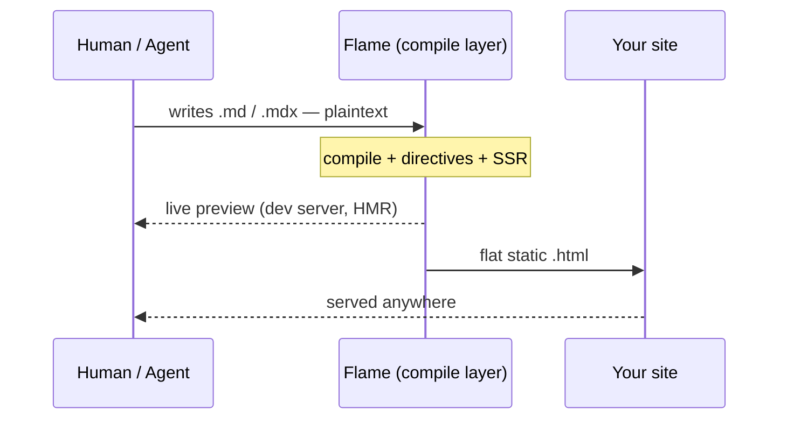

## Why Flame Exists

Building documentation sites often means wrestling with heavyweight frameworks, slow tooling, and complex configuration. Flame takes a different approach: it is **not a runtime**. Flame is a build-time bridge between tooling and content — it reads Markdown, compiles it with React, and writes flat static `.html` files. Bun, Node.js, and Deno are only the engines that run the toolchain and the local dev server; the output has zero runtime dependencies and deploys to any static host.

:::info{title="Contribute"}
  Want to contribute? Visit our [GitHub repository](https://github.com/DocuBook/docubook).
  Feature ideas, bug reports, and pull requests are welcome.
:::

## v2 Direction: Write Markdown, Not JSX

Flame v2 makes a deliberate decision about the authoring contract: **content is plain markdown** — common markdown, fenced code, and a small set of directives (`::`, `:::`, `::::`). Authored JSX tags are no longer part of the contract; content is compiled with `format: "md"` and any JSX-like syntax in prose is treated as text, not code.

`.mdx` and `.md` are parsed identically — the extension does not switch a JSX mode on; Flame always parses markdown, fenced code, and directives. It is purely a naming preference.

The contract is documented in one place: [Formatting](/docs/getting-started/formatting) — with explicit closing rules so nesting is deterministic.

## Why JSX Tags Fight Common Markdown

MDX's selling point — "Markdown + JSX" — comes at a price for documentation:

- **Markdown is plain text; JSX is code.** A markdown document stays readable in any editor, diff, or preview. JSX mixes programming syntax into prose and breaks plain-text tooling.
- **JSX demands component knowledge.** Every tag must resolve to a registered component; unknown tags break the build or render nothing. The author has to know Flame's component inventory just to write a page.
- **Markdown is the interop standard.** GitHub, GitLab, every editor, and every LLM produce and consume common markdown. JSX tags are the #1 source of "why does my page break" in MDX sites.

::info{title="The MDX authors pointed here"}
> This is not a break with MDX — it is the arc MDX itself started. Markdown was designed (2004) to read as plain text: a document that stays readable before it renders. MDX — "Markdown for the component era" — kept that promise while adding JSX. But the MDX 2 rewrite acknowledged that MDX 1's runtime evaluation came at a real cost in speed and predictability, and moved compilation to build time. Flame v2 completes that arc: content stays markdown, components are referenced by name through directives, and JSX never enters the authoring contract.

The direction of v2: **the framework adapts to markdown, not the author to the framework.** Components are referenced by name through directives and resolved by Flame — the author (human or agent) never touches component internals.

## What Flame Brings

- **React-first** — JSX/TSX, hooks, component composition (in your own pages and components, not in content)
- **Directives** — the v2 component system: callouts, tabs, cards, accordions, steps, ASCII trees, and more, written as markdown
- **Eval-free hydration** — content compiles to static ESM modules; production runs without `new Function`, so the CSP needs no `'unsafe-eval'`
- **Fast incremental builds** — deterministic bundle hashing and a content-hash build cache: only changed pages recompile
- **Fast dev server** — memoized MDX compilation: repeat navigations don't re-parse content
- **Filesystem routing** — auto-discover pages from `docs/`
- **Lightweight SSR** — server-side rendering without a heavy framework
- **HMR** — instant reload on content changes during development
- **Static build** — pre-render all pages to static HTML for deployment
- **Built-in search** — full-text search index generated at build time
- **Plugin system** — extend the build pipeline and dev server with hooks
- **Config-driven themes** — switch presets or use custom colors via `docu.json`
- **Runtime-agnostic** — the same CLI, the same output, on Bun, Node.js, or Deno

## One Format for Humans and Agents

Common markdown is the most widely produced writing format — by humans and by AI agents alike. Flame's contract deliberately stays inside that format:

- **No special knowledge required.** A human writes `- [ ] task` or `| a | b |`; an agent writes the same. Neither needs Flame's component list.
- **Explicit close rules.** Every directive that opens must close, with the same marker length. No ambiguous nesting for a generator (or a human) to guess at.
- **Deterministic output.** The same markdown produces the same page — on any machine, on any run. That is what makes agent-written content safe to commit and review.

The result is one format for every author: a human writing docs by hand, an LLM generating pages, and a reviewer diffing both.

## Technology Stack

- **Runtime** — Bun, Node.js `^20.19 || ^22.13 || >=24`, or Deno (auto-detected)
- **React 19 + React DOM** — rendering (SSR + client hydration)
- **@docubook/core** — MDX compilation, remark/rehype plugins, directive system
- **@docubook/markdown** — component registry (callout, tabs, cards, tree, steps, accordion, …)
- **@docubook/ui-react** — reusable UI components (sidebar, TOC, navbar)
- **@docubook/themes-colors** — config-driven color system
- **Tailwind CSS v4 + daisyUI v5** — styling
- **Lucide React** — icons

## Architecture

One pipeline, nothing to run in production:

```mermaid
sequenceDiagram
    participant Author as Human / Agent
    participant Flame as Flame (compile layer)
    participant Site as Your site

    Author->>Flame: writes .md / .mdx — plaintext
    Note over Flame: compile + directives + SSR
    Flame-->>Author: live preview (dev server, HMR)
    Flame->>Site: flat static .html
    Site-->>Author: served anywhere
```

Write plaintext — the format humans and agents already know. Flame compiles it into flat static `.html`; deploy it anywhere. Bun, Node.js, and Deno only run the toolchain and the dev server — the output itself has no runtime.

## Build vs Dev Server

|              | Dev Server                          | Static Build                       |
| ------------ | ----------------------------------- | ---------------------------------- |
| Command      | `flame dev`                         | `flame build`                      |
| Output       | Dynamic SSR with HMR                | Static HTML files in `.docu/dist/` |
| Use case     | Writing and previewing content      | Deployment to production           |
| Features     | Hot reload, plugin API, search      | Pre-rendered pages, search index   |
| Dependencies | Toolchain (Bun / Node / Deno)      | None — flat static HTML             |
