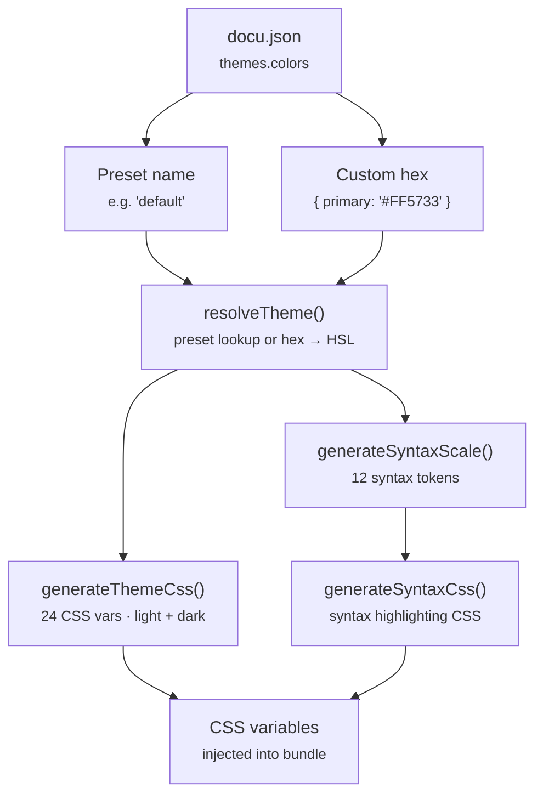

DocuBook comes with a config-driven theme system that lets you switch between color presets or define custom colors — all from `docu.json`. Each preset includes both light and dark modes with full variable coverage.

## Config-Driven Themes

Set your theme in `docu.json` using the `themes.colors` field. The system supports **preset names** and **custom hex values**.

### Quick Start

```json
{
  "themes": {
    "colors": "default"
  }
}
```

Switch to another preset:

```json
{
  "themes": {
    "colors": "freshlime"
  }
}
```

Use a custom brand color:

```json
{
  "themes": {
    "colors": {
      "primary": "#FF5733"
    }
  }
}
```

The system automatically generates all 24 CSS variables (background, foreground, primary, accent, daisyUI tokens, etc.) for both light and dark modes from a single primary color. No need to hand-craft every variable.

> **Note**: Only `primary` is configurable when using custom hex. The entire 24-variable palette (light + dark) is auto-generated from it.

### Available Presets

| Preset | Hue | Description |
|--------|-----|-------------|
| `default` | ~210 (blue) | Modern blue — used by the official DocuBook website |
| `freshlime` | ~85 (green) | Warm lime — designed for better contrast in dark mode |
| `coffee` | ~25-35 (brown) | Rich coffee — elegant brown with an expensive feel |

### CLI Override

Override the theme without editing `docu.json` using the `--theme` flag:

```bash
flame dev --theme freshlime
flame build --theme coffee
flame preview --theme default
```

This is useful for testing themes quickly across all commands (`dev`, `build`, `preview`).

## How It Works

Themes are powered by `@docubook/themes-colors`, a separate package that ships:

- **JSON data** — preset theme variables and syntax tokens, CDN-ready via jsdelivr
- **Resolver** — maps `docu.json` config to actual theme values (preset lookup or custom hex → HSL)
- **CSS generator** — produces the complete `@layer base` block with `:root` and `.dark` variable sets

### Architecture



The theme CSS is compiled into the same bundle as Tailwind globals and injected as inline `<style>` for FOUC prevention.

### Token Coverage

Each preset includes **24 CSS variables** per mode (root + dark):

|                 shadcn-style                 |     DaisyUI      |   Layout   |
| -------------------------------------------- | ---------------- | ---------- |
| `--background`                               | `--base-100`     | `--radius` |
| `--foreground`                               | `--base-200`     |            |
| `--card` / `--card-foreground`               | `--base-300`     |            |
| `--popover` / `--popover-foreground`         | `--base-content` |            |
| `--primary` / `--primary-foreground`         |                  |            |
| `--secondary` / `--secondary-foreground`     |                  |            |
| `--muted` / `--muted-foreground`             |                  |            |
| `--accent` / `--accent-foreground`           |                  |            |
| `--destructive` / `--destructive-foreground` |                  |            |
| `--border`                                   |                  |            |
| `--input`                                    |                  |            |
| `--ring`                                     |                  |            |

Plus **12 syntax tokens** (keyword, function, punctuation, comment, string, constant, annotation, boolean, number, tag, attrName, attrValue) for code highlighting.
