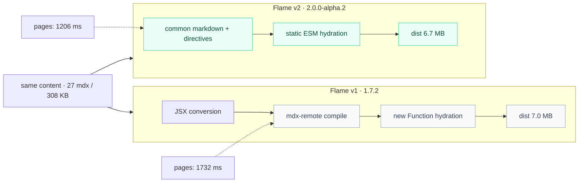
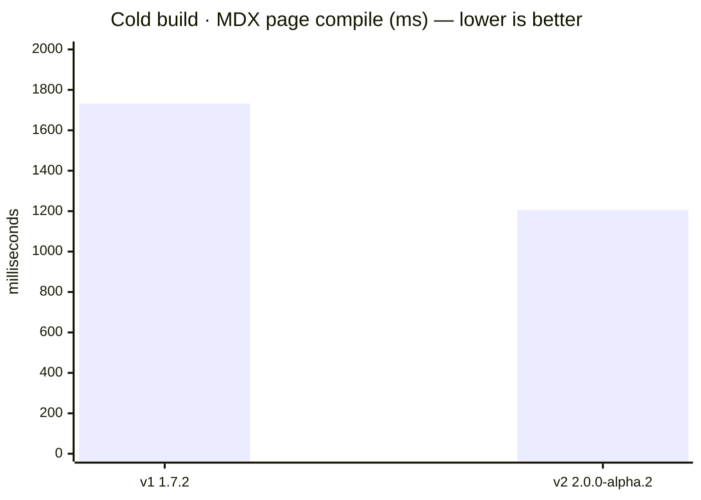

**@docubook/flame** compiles plain markdown (`.md` / `.mdx`) into flat static HTML — a build-time bridge, not a runtime. Bun, Node.js, or Deno only run the toolchain; the output deploys anywhere.

- [Quick start](/docs/getting-started/quick-start-guide) — a docs site in minutes
- [Formatting](/docs/getting-started/formatting) — the v2 authoring contract: markdown, fenced code, directives
- [Introduction](/docs/getting-started/introduction) — why v2 is markdown-first, not JSX

::::cards{cols="2"}
  :::card{title="@docubook/core" icon="Cpu"}
    Compile pipeline — remark/rehype plugins, frontmatter, and the directive system that turns `:::` / `::::` into components.
  :::
  :::card{title="@docubook/markdown" icon="Package"}
    Component registry — callout, tabs, cards, accordions, steps, tree, mermaid, youtube, tooltip — resolved from directives at compile time.
  :::
  :::card{title="@docubook/ui-react" icon="Component"}
    React + daisyUI — sidebar, TOC, navbar, footer, search modal.
  :::
  :::card{title="@docubook/themes-colors" icon="Palette"}
    Theme color presets and utilities — hex-to-HSL conversion, CSS variables, 3 built-in presets.
  :::
::::

::warning{title="Performance: v1 vs v2"}

> A same-docs benchmark: the full Flame documentation (27 `.mdx`, 308 KB) built
> by both versions on Node 22, `NODE_ENV=production`, cold cache. Both are
> installed from the npm registry (`1.7.2` / `2.0.0-alpha.2`) and measured
> back-to-back on the same machine — medians of 3 cold builds each.

> The same raw content forks at the entry: **v1 cannot parse v2's directive
> syntax** — 19 of 26 files carry directives and fail with `Could not parse
> expression with acorn`, because mdx-remote reads `{...}` attribute blocks
> as JSX. Those files were converted to v1-native JSX (the migration table in
> [Formatting](/docs/getting-started/formatting)), then both versions build
> all 26 pages. What differs is the measured compile phase and the output.

| Metric | v1 1.7.2 | v2 2.0.0-alpha.2 | Δ |
| ------ | -------- | ----------------- | - |
| MDX page compile | 1732 ms | 1206 ms | **−30%** |
| Client bundle | 2933 ms | 2560 ms | **−13%** |
| Total wall | 5.26 s | 6.25 s | +0.99 s |
| dist size | 7.0 MB | 6.7 MB | **−4%** |
| client JS | 4.3 MB | 4.8 MB | +12% |
| Pages built | 26/26 (after conversion) | 26/26 (as-is) | — |

> Reading the numbers: v2 compiles pages **30% faster**, bundles **13%
> faster**, and ships a **4% smaller dist** — while the raw client JS is 12%
> larger (eval-free ESM modules + daisyUI runtime). The `+0.99 s` wall is the
> price of v2's hydration model — a prePass that compiles each page to a
> static ESM module for eval-free hydration, which v1 does not have (v1
> re-uses the SSR `compiledSource` via `new Function`). That prePass is the
> double-parse targeted by the build cache fix: with warm cache, a no-change
> build skips it entirely.
