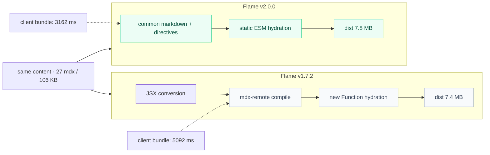
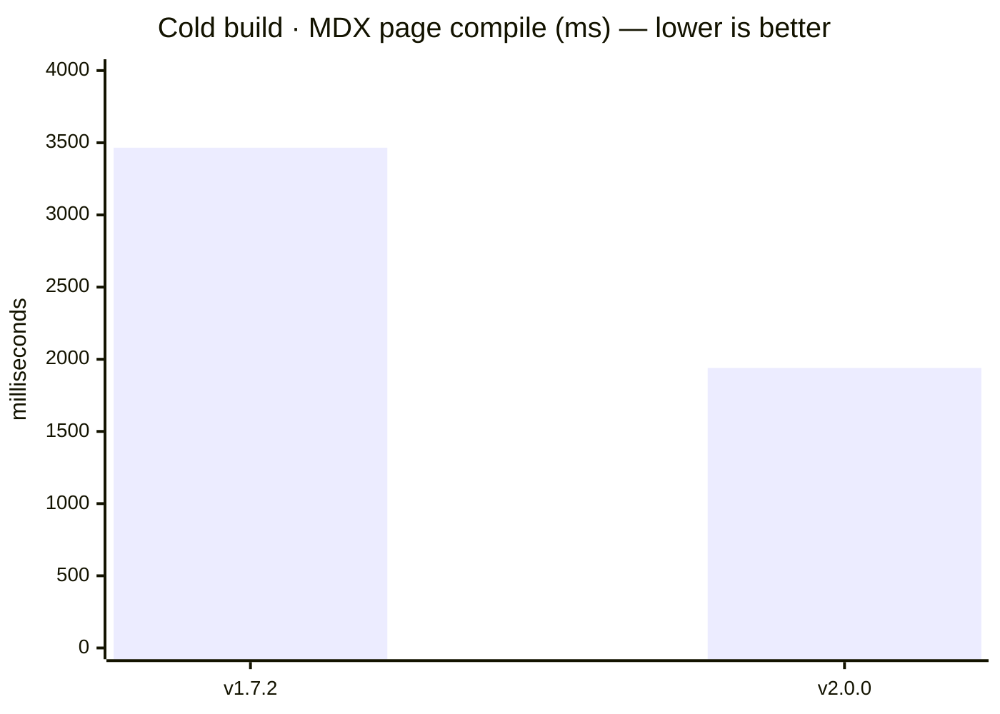

**@docubook/flame** compiles plain markdown (`.md` / `.mdx`) into flat static HTML — a build-time bridge, not a runtime. Bun, Node.js, or Deno only run the toolchain; the output deploys anywhere.

- [Quick start](/docs/getting-started/quick-start-guide) — a docs site in minutes
- [Formatting](/docs/getting-started/formatting) — the v2 authoring contract: markdown, fenced code, directives
- [Introduction](/docs/getting-started/introduction) — why v2 is markdown-first, not JSX

::::cards{cols="2"}
  :::card{title="@docubook/core" icon="Cpu"}
    Compile pipeline — remark/rehype plugins, frontmatter, and the directive system that turns `:::` / `::::` into components.
  :::
  :::card{title="@docubook/markdown" icon="Package"}
    Component registry — callout, tabs, cards, accordions, steps, tree, mermaid, youtube, tooltip — resolved from directives at compile time.
  :::
  :::card{title="@docubook/ui-react" icon="Component"}
    React + daisyUI — sidebar, TOC, navbar, footer, search modal.
  :::
  :::card{title="@docubook/themes-colors" icon="Palette"}
    Theme color presets and utilities — hex-to-HSL conversion, CSS variables, 3 built-in presets.
  :::
::::

::warning{title="Performance: v1 vs v2"}

> Benchmark setup: the same 27 `.mdx` files (106 KB), npm releases `v1.7.2` and
> `v2.0.0`, `NODE_ENV=production`, three cold builds on the same machine. v1 ran
> on Node 22.23.2; v2 ran on Bun 1.4.2. Because v1's mdx-remote interprets
> directive attributes (`{...}`) as JSX expressions, 19 files were converted to
> native JSX using the [Formatting](/docs/getting-started/formatting) mapping;
> v2 built the source unchanged.

> The table reports medians from three cold builds. Per-run wall times were
> **12 / 10 / 12 s** for v1 and **13.71 / 8.00 / 7.67 s** for v2. Because the
> benchmarks use different runtimes (Node for v1, Bun for v2), the deltas are
> directional rather than a controlled runtime comparison.

| Metric | v1.7.2 | v2.0.0 | Δ |
| ------ | -------- | ----------------- | - |
| MDX page compile | 3466 ms | 1940 ms | **−44%** |
| Client bundle | 5092 ms | 3162 ms | **−38%** |
| dist size | 7.4 MB | 7.8 MB | **+5%** |
| client JS | 4.6 MB | 5.7 MB | **+24%** |
| Pages built | 26/26 (after conversion) | 26/26 (as-is) | — |
| Total wall | ≈12 s | 8.00 s | **−4 s** |
