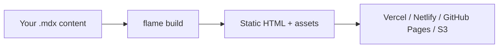

**@docubook/flame** is a static site generator for documentation. Write in MDX, compile to flat static HTML — no server required. Runs on **Bun**, **Node.js**, and **Deno**.

Check the sidebar for guides on getting started, configuration, components, routing, and deployment.
