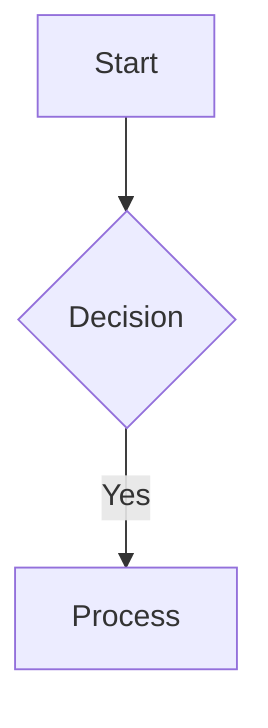

# Feature Contract: Mermaid-MDX Integration

> **Feature:** Mermaid.js diagram rendering inside MDX content
> **Package:** `@docubook/mdx-content`
> **Tech Stack:** React 19, TypeScript 6, MDX, next-mdx-remote, Mermaid.js
> **Status:** Draft — ready for task breakdown
> **Date:** 2026-07-03
> **Source Design:** `mermaid-mdx-integration-tech-design.md`

---

## Executive Summary

DocuBook content authors want to write diagrams (flowchart, sequence, class, etc.)
directly in `.mdx` files without external tools. This feature provides a `<Mermaid>`
component that renders Mermaid text-based definitions into interactive SVG in the
browser — just like GitHub, Docusaurus, and VitePress.

**Key revision:** Mermaid definitions are authored via fenced code blocks (` ```mermaid `),
not JSX children — because Mermaid syntax uses `{...}` (decisions) and `[...]` (labels)
which collide with MDX's JSX expression parsing. A rehype plugin in `@docubook/core`
transforms the fenced block into a `<Mermaid chart="...">` element. A `<Mermaid chart="...">`
escape hatch remains for programmatic use.

---

## Scope

| In Scope | Out of Scope |
|----------|--------------|
| `<Mermaid>` component for MDX | SSR pre-render to static SVG |
| Client-side hydration via `mermaid.run()` | Live Editor integration |
| All diagram types (flowchart, sequence, class, state, gantt, pie, git, erd) | Theme editor UI |
| Dark/light theme via MutationObserver on `document.documentElement.classList` | Export PNG/SVG |
| Lazy loading via IntersectionObserver | Real-time collaboration |
| Error fallback (invalid syntax → show raw code) | — |
| Rehype plugin to transform ` ```mermaid ` fenced blocks | — |

### Invariants

1. Diagram definition **MUST** be non-empty
2. Each diagram **MUST** have a unique DOM `id`
3. SSR: render placeholder `<pre class="mermaid">`, **must not** throw
4. `mermaid` library loaded via dynamic import, not in initial bundle
5. Re-render only triggered by theme change, not by other React state
6. Theme detection uses `MutationObserver` on `<html class>`, not `matchMedia` — because DocuBook's theme toggle is class-driven (next-themes + flame localStorage script), not OS-preference-driven

---

## API Contract

### MDX Authoring Surface

Primary syntax — fenced code block (matches GitHub/VitePress/Docusaurus):

````mdx

````

Internally, the rehype plugin rewrites this into `<Mermaid chart="...">` component.

### `<Mermaid>` Component

```
Props:
  chart: string            (required) — Mermaid syntax definition (from rehype plugin or programmatic)
  id?: string              (optional) — custom DOM id, auto-generated if empty
  className?: string       (optional) — additional CSS class
```

> **Note:** Per-diagram theme overrides are expressed via `%%{init: {"theme": "forest"}}%%`
> directives inside the chart definition — mermaid's `initialize()` is global-only and
> does not accept per-node config, so a `config` prop would cause race conditions between
> diagrams. Global theme is managed automatically via the MutationObserver theme-sync logic.

### MDX Usage

```mdx
<Mermaid chart="graph TD&#10;  A[Start] --> B{Decision}&#10;  B -->|Yes| C[Process]">
</Mermaid>
```

### Lifecycle (SSR → Client)

```
SSR:  <pre class="mermaid not-prose">{chart}</pre>
       ↓ (hydrate)
Client:
  1. dynamic import('mermaid') — singleton promise, shared across instances
  2. mermaid.initialize({ startOnLoad: false })
  3. mermaid.parse(chart) — validate syntax
  4. queueMicrotask → mermaid.run({ nodes: [ref] }) — batched one call for all
  5. MutationObserver on document.documentElement.classList → re-render on theme change
```

---

## Files Changed

| File | Action |
|------|--------|
| `packages/mdx-content/src/components/MermaidMdx.tsx` | CREATE |
| `packages/mdx-content/src/components/index.ts` | UPDATE — export `MermaidMdx` |
| `packages/mdx-content/src/client.ts` | UPDATE — export `MermaidMdx` (client-only) |
| `packages/mdx-content/src/registry/index.ts` | UPDATE — register `Mermaid` |
| `packages/mdx-content/package.json` | UPDATE — add `mermaid` as dependency (see dep strategy below) |
| `apps/web/lib/mdx-components.ts` | UPDATE — add `Mermaid` override |
| `packages/core/src/plugins/rehypeMermaid.ts` | CREATE — rehype plugin for ` ```mermaid ` → `<Mermaid>` |
| `packages/core/src/compile.ts` | UPDATE — register mermaid rehype plugin |

### Dependency Strategy

`mermaid` is a **direct dependency** of `@docubook/mdx-content`, not an optional peer:
- TypeScript needs `mermaid` types at build time for `import('mermaid')`
- Code-splitting via dynamic import keeps it out of the initial bundle regardless
- Consumers (web app, flame) don't need to remember to install it

---

## Verification / Acceptance Criteria

- [ ] ` ```mermaid ` fenced block renders as SVG diagram (primary path)
- [ ] `<Mermaid chart="...">` prop syntax works (escape hatch)
- [ ] Component renders `<pre class="mermaid">` placeholder during SSR
- [ ] Diagram renders as SVG after client hydration
- [ ] Diagram with syntax error shows error fallback (raw code)
- [ ] Dynamic import of `mermaid` does not inflate main JS bundle
- [ ] Dark/light theme syncs automatically — works with both next-themes and flame
- [ ] Multiple diagrams on one page — each has a unique ID
- [ ] `mermaid` imported only once, `run()` called once per batch
- [ ] No errors/warnings in console during SSR
- [ ] Existing MDX files unaffected (backward-compatible)
- [ ] IntersectionObserver delays render for off-screen diagrams

---

## Related Documents

| Document | Path |
|----------|------|
| Technical Design Brief | `mermaid-mdx-integration-tech-design.md` |
| Task Backlog | `mermaid-mdx-integration-tasks.md` |
| Mermaid.js Usage | https://mermaid.js.org/config/usage.html |
| Mermaid.js API | https://mermaid.js.org/config/setup/mermaid/README.html |
