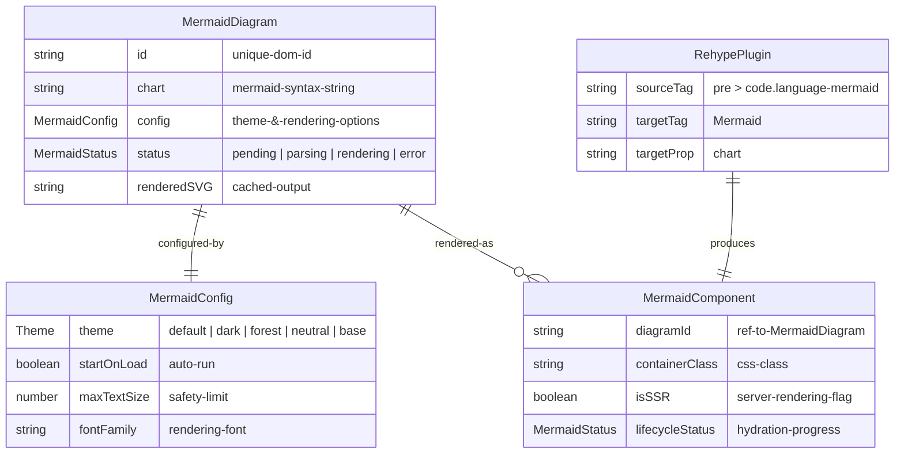
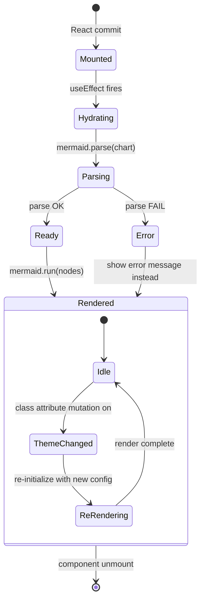
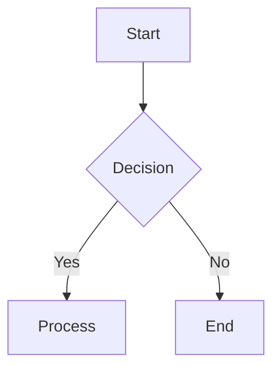
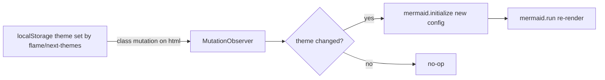

# Mermaid-MDX Integration — Technical Design Brief

> **Feature:** Mermaid.js diagram rendering inside MDX content
> **Package:** `@docubook/mdx-content`
> **Status:** Draft v2
> **Date:** 2026-07-03

---

## 1. Requirements Analysis

### Actors & Roles

|         Actor         |          Role          |                          Responsibility                          |
| --------------------- | ---------------------- | ---------------------------------------------------------------- |
| **Content Author**    | Documentation writer   | Writes Mermaid diagram definitions inside `.mdx` files           |
| **Reader / End User** | Documentation consumer | Views rendered SVG diagrams in browser                           |
| **DocuBook Platform** | Rendering engine       | Compiles MDX → React tree, hydrates Mermaid diagrams client-side |

### Scope

|                                          In Scope                                           |                        Out of Scope                         |
| ------------------------------------------------------------------------------------------- | ----------------------------------------------------------- |
| Mermaid diagram rendering in MDX content via ` ```mermaid ` fenced code blocks              | Server-side pre-rendering of Mermaid diagrams to static SVG |
| Client-side hydration using `mermaid.run()` API                                             | Mermaid Live Editor integration                             |
| Support for all Mermaid diagram types (flowchart, sequence, class, state, gantt, pie, etc.) | Custom Mermaid theme editor in UI                           |
| Dark/light theme via MutationObserver on `<html class>` attribute                           | Real-time collaborative diagram editing                     |
| Lazy loading — only render when diagram enters viewport                                     | Mermaid diagram export (PNG/SVG download)                   |
| Rehype plugin to transform ` ```mermaid ` into `<Mermaid chart="...">`                      |                                                             |

### Invariants

```
1. diagram definition string MUST be non-empty
2. diagram definition MUST be syntactically valid Mermaid
3. component MUST render a placeholder during SSR (Mermaid is browser-only)
4. component MUST NOT throw during SSR — graceful degradation only
5. each diagram instance MUST have a unique DOM id for mermaid.run()
6. mermaid library MUST be loaded only once regardless of diagram count
7. diagram re-render MUST NOT occur on unrelated React state changes
8. theme detection MUST use MutationObserver on <html class>, NOT matchMedia
   (DocuBook uses class-driven theme via next-themes + flame localStorage)
```

---

## 2. Global Benchmarking

### Industry Patterns

- **GitHub Markdown**: Renders Mermaid via ` ```mermaid ` fenced blocks — server detects Mermaid blocks, client hydrates with inline mermaid.js.
- **Obsidian**: Uses Mermaid plugin, renders inside note preview, supports dark/light themes.
- **Docusaurus**: `@docusaurus/theme-mermaid` — provides `Mermaid` component using `mermaid.render()` with SSR-safe placeholder and theme sync.
- **VitePress**: Built-in `mermaid` markdown container, renders via `mermaid.run()` on mounted.

### Key Takeaways

|   Source   |                   Approach                   |                                                      Lesson                                                       |
| ---------- | -------------------------------------------- | ----------------------------------------------------------------------------------------------------------------- |
| Docusaurus | `useEffect` + `mermaid.render()` per diagram | Each diagram needs unique `id`; must `mermaid.parse()` before render                                              |
| VitePress  | `mermaid.run({ nodes })` batch               | More efficient than per-diagram render — one `run()` call processes all `<pre class="mermaid">` tags in container |
| GitHub     | ` ```mermaid ` fenced blocks                 | Standard markdown syntax — no JSX parsing conflicts                                                               |

### Chosen Strategy

1. **Authoring**: ` ```mermaid ` fenced code blocks → rehype plugin rewrites into `<Mermaid chart="...">`. This avoids JSX parsing conflicts with Mermaid's `{...}` and `[...]` syntax, and matches the ecosystem standard (GitHub, VitePress, Docusaurus).

2. **Rendering**: `mermaid.run({ nodes: [...] })` batch pattern (VitePress-like). `<Mermaid>` component renders `<pre class="mermaid">`, `useEffect` calls `mermaid.run()` on mounted DOM nodes.

---

## 3. Data Model

### Entities



### Key Design Decisions

1. **Mermaid definition comes from fenced code blocks** — rehype plugin extracts the code text as a `chart` string prop on `<Mermaid>`. No raw Mermaid text as JSX children.
2. **Config cascades**: global `mermaid.initialize()` default → per-diagram `%%{init: {...}}%%` directives inside the chart definition. `initialize()` is global-only, so there is no per-diagram config prop.
3. **SSR renders a placeholder `<pre>`** — Mermaid only runs client-side. No SSR of SVG to avoid hydration mismatch and bundle size.
4. **`mermaid` is a direct dependency** of `@docubook/mdx-content` (not optional peer) — TypeScript needs types at build time, and the dynamic import code-splits it out of the initial bundle regardless.

---

## 4. State Machine



### Transitions

|      From      |       To       |                   Trigger                   |              Guard              |
| -------------- | -------------- | ------------------------------------------- | ------------------------------- |
| `Mounted`      | `Hydrating`    | `useEffect` mount                           | `typeof window !== 'undefined'` |
| `Hydrating`    | `Parsing`      | `mermaid.parse()` called                    | chart non-empty                 |
| `Parsing`      | `Ready`        | parse returns success                       | syntax valid                    |
| `Parsing`      | `Error`        | parse throws                                | syntax invalid                  |
| `Ready`        | `Rendered`     | `mermaid.run({ nodes })`                    | DOM node mounted                |
| `Idle`         | `ThemeChanged` | `MutationObserver` detects class change     | —                               |
| `ThemeChanged` | `ReRendering`  | `mermaid.initialize({ theme })` + re-run    | —                               |

---

## 5. API Surface

### Rehype Plugin: `rehypeMermaid`

```
Transforms:
  <pre><code class="language-mermaid">graph TD
    A[Start] --> B{Decision}
  </code></pre>

Into:
  <Mermaid chart="graph TD&#10;A[Start] --> B{Decision}&#10;">
  </Mermaid>
```

### Component: `<Mermaid>`

```
Mermaid {
  required:
    chart: string       // Mermaid diagram definition content (from rehype plugin or manual)

  optional:
    id?: string            // custom DOM id (auto-generated if omitted)
    className?: string     // additional CSS class on container

  // Per-diagram theme overrides: use %%{init: {"theme": "forest"}}%% directive inside
  // the chart definition. mermaid.initialize() is global-only — a config prop would
  // race between concurrent diagram instances. Global theme is synced automatically
  // via MutationObserver on document.documentElement.classList.

  SSR behavior:
    renders <pre class="mermaid not-prose">{chart}</pre>
    — Mermaid auto-detects this tag on client hydration

  Client behavior (hydration):
    1. generate unique id if not provided
    2. await singleton mermaid promise (module-level: let mermaidPromise; first
       mount assigns mermaidPromise = import("mermaid"), all instances await
       the same promise — satisfies invariant 6)
    3. mermaid.initialize({ startOnLoad: false, theme: currentTheme })
    4. mermaid.parse(chart) — guard against invalid syntax
    5. push ref to module-level pending set; queueMicrotask flushes once,
       calling mermaid.run({ nodes: [...pending] })
    6. on unmount: no cleanup needed (SVG is plain DOM)
    7. on theme change: MutationObserver on document.documentElement.classList
       detects class attribute mutations → re-initialize mermaid with new
       theme → re-run
}
```

### MDX Usage

Primary syntax — fenced code block:

````mdx

````

Escape hatch — prop-based (for programmatic use):

```mdx
<Mermaid chart="sequenceDiagram&#10;Alice->>John: Hello John, how are you?&#10;John-->>Alice: Great!" />
```

### Integration Points

|                Layer                |                  Integration                  |                                       Detail                                        |
| ----------------------------------- | --------------------------------------------- | ----------------------------------------------------------------------------------- |
| **`@docubook/core`**                | New rehype plugin `rehypeMermaid`             | Register in `createDefaultRehypePlugins()` pipeline                                 |
| **`@docubook/mdx-content`**         | New component `MermaidMdx`                    | Export from `src/components/`, add to `registry/index.ts` and `createMdxComponents` |
| **`@docubook/mdx-content` exports** | Add to `client.ts` (client-only)              | Mermaid is client-only — export from `client.ts` only                               |
| **Web app**                         | Add to `mdx-components.ts` built-in overrides | Register `<Mermaid>` tag                                                            |
| **Core compile pipeline**           | Update `compile.ts` to include rehype plugin  | Add `rehypeMermaid` to `createDefaultRehypePlugins()`                               |
| **package.json**                    | Add `mermaid` as direct dependency            | Tree-shaken via dynamic import, types needed at build time                          |

---

## 6. Performance & Scalability

### Data Volume & Patterns

|         Metric          |            Expectation             |
| ----------------------- | ---------------------------------- |
| Diagrams per page       | 1–20 (typical doc page: 1–5)       |
| Diagram definition size | 50–500 chars per diagram           |
| Mermaid library size    | ~2.4 MB minified, several hundred KB gzipped (effectively monolithic) |
| Concurrent readers      | N/A (static site, per-reader)      |

### Rendering Strategy

1. **Dynamic import `mermaid`** — not bundled into main JS chunk. Module-level singleton promise ensures one load regardless of diagram count.
2. **Batch `mermaid.run()`** — single call processes all pending `<pre class="mermaid">` nodes via queueMicrotask flush.
3. **Lazy hydration** — IntersectionObserver with generous rootMargin (200px) delays render for off-screen diagrams.
4. **SSR placeholder** — `<pre>` tag is lightweight, no SVG during SSR.

### Caching

|    Cache Layer    |     Key      |           TTL           |    Invalidation    |
| ----------------- | ------------ | ----------------------- | ------------------ |
| Mermaid module    | URL          | Session (browser cache) | Page reload        |
| Parsed definition | content hash | Per-page render         | Component re-mount |
| Config merge      | —            | Per-page render         | Theme change       |

### Theme Synchronization



- Use **MutationObserver** on `document.documentElement.classList`, not `matchMedia('prefers-color-scheme')`:
  - `next-themes` (web app) toggles a `dark` class via `ThemeProvider`
  - flame (static site) injects `<script>localStorage.getItem("theme")==="dark" → add dark class</script>` in `html.ts`
  - Both converge on the same signal: `document.documentElement.classList.contains("dark")`
- Debounce theme transitions (200ms) to avoid double-render during rapid toggles.
- Keep the original chart string in a `useRef` — mermaid replaces the container's innerHTML on render.

### Bundle Impact

| Asset | Without Mermaid | With Mermaid | Delta |
|-------|----------------|--------------|-------|
| Main JS bundle | ~150 KB | ~150 KB | 0 (dynamic import) |
| Mermaid chunk (lazy) | — | several hundred KB (minified gzip) | only on diagram pages, deferred by IntersectionObserver |
| CSS | existing | +0 (Mermaid renders inline SVG) | 0 |

- Use `mermaid` npm package (not CDN), loaded via dynamic import — the bundle is effectively monolithic, so unused diagram types are NOT tree-shaken away; code-splitting (not tree-shaking) is what keeps it out of the main chunk.
- No smaller official build of mermaid exists — the mitigation is lazy loading (dynamic import + IntersectionObserver), not a lighter package.
- Re-measure the real chunk size with the bundle analyzer during T-002 so acceptance criteria use measured numbers, not estimates.

---

## 7. Edge Cases & Resilience

|                Case                 |                                     Strategy                                      |
| ----------------------------------- | --------------------------------------------------------------------------------- |
| **Empty definition**                | `<Mermaid chart="">` → render nothing, warn in dev                                |
| **Invalid Mermaid syntax**          | `mermaid.parse()` throws → render error banner with fallback showing raw code     |
| **SSR / No window**                 | Return `<pre class="mermaid">` placeholder, never import mermaid                  |
| **Multiple rapid re-renders**       | Debounce `mermaid.run()` with 100ms window + queueMicrotask coalescing            |
| **Diagram with special HTML chars** | Mermaid handles its own escaping; chart prop is plain string                       |
| **Accessibility**                   | Mermaid generates SVG with `role="img"` and `aria-label` — add `<title>` fallback |
| **RTL content**                     | Mermaid respects direction via config `{ rtl: true }`                             |
| **Very large diagrams**             | `maxTextSize` config caps definition length (default 50000)                       |
| **Fenced block not in MDX**         | Rehype plugin only runs on compiled MDX — raw Mermaid in HTML unaffected           |

---

## 8. File Changes Summary

|                         File                         |                            Action                            |
| ---------------------------------------------------- | ------------------------------------------------------------ |
| `packages/core/src/plugins/rehypeMermaid.ts`          | **CREATE** — rehype plugin for ` ```mermaid ` → `<Mermaid>` |
| `packages/core/src/index.ts`                          | **UPDATE** — re-export `rehypeMermaid` (no `plugins/index.ts` barrel exists yet) |
| `packages/core/src/compile.ts`                        | **UPDATE** — add `rehypeMermaid` to `createDefaultRehypePlugins` |
| `packages/mdx-content/src/components/MermaidMdx.tsx`  | **CREATE** — Mermaid component                                |
| `packages/mdx-content/src/components/index.ts`        | **UPDATE** — re-export `MermaidMdx`                           |
| `packages/mdx-content/src/client.ts`                  | **UPDATE** — export `MermaidMdx` (client-only)                |
| `packages/mdx-content/src/registry/index.ts`          | **UPDATE** — register `Mermaid` in `createMdxComponents`      |
| `packages/mdx-content/package.json`                   | **UPDATE** — add `mermaid` as direct dependency                |
| `apps/web/lib/mdx-components.ts`                      | **UPDATE** — add `Mermaid: MermaidMdx` to built-in overrides  |

---

## 9. Verification Checklist

- [ ] Business problem addressed: MDX content authors can embed diagrams using ` ```mermaid ` fenced blocks
- [ ] Data model is backward-compatible: no existing MDX files break
- [ ] Integration points identified: `@docubook/core` rehype plugin + `@docubook/mdx-content` registry + web app override
- [ ] NO code blocks included in this design (only pseudocode/requirements)
- [ ] State machine is complete: covers mount → parse → render → re-theme → unmount
- [ ] Mermaid ERD validated with `mmdc`
- [ ] Mermaid state diagram validated with `mmdc`
- [ ] Mermaid flow diagram validated with `mmdc`
- [ ] Actors + Roles + Scope documented

---

## Related Documents

| Document | Path |
|----------|------|
| Feature Contract | `mermaid-mdx-integration-contract.md` |
| Task Backlog | `mermaid-mdx-integration-tasks.md` |
| Mermaid.js Usage | https://mermaid.js.org/config/usage.html |
| Mermaid.js API | https://mermaid.js.org/config/setup/mermaid/README.html |
