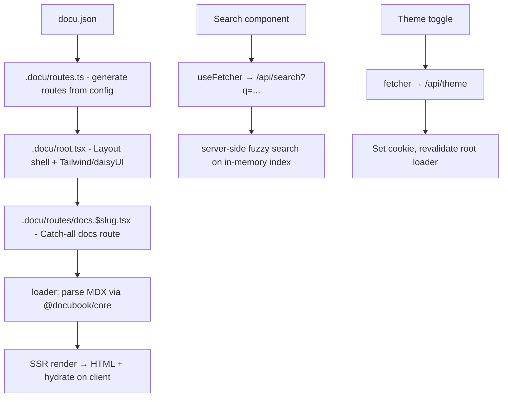

# @docubook/rerouter — Implementation Plan

> Vite + React Router v7 (Framework Mode) + SSR + Hydration + daisyUI/Tailwind

## Problem Statement

Membuat package baru `@docubook/rerouter` sebagai alternatif `@docubook/flame` yang menggunakan Vite sebagai bundler dan React Router v7 (framework mode) dengan SSR + Hydration. Tetap menggunakan daisyUI + Tailwind CSS sebagai base UI dan `docu.json` sebagai config.

Berbeda dengan flame yang output static HTML, rerouter membutuhkan **server runtime (Node.js)** di production.

## Requirements

1. Package baru `@docubook/rerouter` di `packages/rerouter`
2. Full feature parity dengan flame (MDX, search, sidebar, TOC, theme, pagination, breadcrumb, dll)
3. `docu.json` sebagai config file
4. SSR + Hydration via React Router v7 framework mode (`@react-router/serve`)
5. Vite sebagai bundler
6. Server-side search (bukan static JSON)
7. Base components: daisyUI + Tailwind CSS wrapper React (port dari flame)
8. Reuse `@docubook/core` dan `@docubook/mdx-content`

## Architecture

Struktur directory mengikuti konvensi flame — `.docu/` sebagai app code, `docs/` untuk konten MDX, `docu.json` di root. React Router v7 mendukung custom `appDirectory` via `react-router.config.ts`.

```
packages/rerouter/
├── .docu/                          # appDirectory (sama seperti flame)
│   ├── root.tsx                    # HTML shell, global CSS, meta
│   ├── entry.client.tsx            # HydratedRouter
│   ├── entry.server.tsx            # SSR entry (optional custom)
│   ├── routes.ts                   # Programmatic routes dari docu.json
│   ├── routes/
│   │   ├── home.tsx                # Landing page (/)
│   │   ├── docs.$slug.tsx          # Catch-all docs route
│   │   ├── api.search.ts           # Server-side search resource route
│   │   └── api.theme.ts            # Theme cookie resource route
│   ├── layouts/
│   │   └── docs.tsx                # Docs layout (sidebar + navbar + outlet)
│   ├── components/
│   │   ├── base/                   # daisyUI wrapper components
│   │   │   ├── collapse.tsx
│   │   │   ├── modal.tsx
│   │   │   ├── dropdown.tsx
│   │   │   ├── drawer.tsx
│   │   │   ├── input.tsx
│   │   │   ├── kbd.tsx
│   │   │   ├── navbar.tsx
│   │   │   ├── pagination.tsx
│   │   │   ├── toggle.tsx
│   │   │   ├── theme-controller.tsx
│   │   │   └── breadcrumbs.tsx
│   │   ├── Sidebar.tsx
│   │   ├── Navbar.tsx
│   │   ├── Menu.tsx
│   │   ├── Footer.tsx
│   │   ├── Toc.tsx
│   │   ├── Breadcrumb.tsx
│   │   ├── Pagination.tsx
│   │   ├── Search.tsx
│   │   ├── Theme.tsx
│   │   ├── Context.tsx
│   │   ├── ScrollTo.tsx
│   │   ├── EditWith.tsx
│   │   ├── Typography.tsx
│   │   └── registry.ts
│   ├── lib/
│   │   ├── utils.ts                # cn() utility
│   │   ├── config.server.ts        # Read docu.json
│   │   ├── route-resolver.server.ts # Route resolution + prev/next
│   │   ├── mdx.server.ts           # MDX parsing via @docubook/core
│   │   ├── search-indexer.server.ts # Build search index at startup
│   │   ├── search.server.ts        # Fuzzy search engine
│   │   ├── theme.ts                # Theme cookie helpers
│   │   └── types.ts                # Shared types
│   └── styles/
│       └── globals.css             # Tailwind + daisyUI + custom styles
├── docs/                           # MDX content (same as flame)
├── docu.json                       # Site configuration
├── react-router.config.ts          # appDirectory: ".docu", ssr: true
├── vite.config.ts                  # reactRouter() plugin + tailwind
├── tsconfig.json
├── package.json
└── README.md
```

```ts
// react-router.config.ts
import type { Config } from "@react-router/dev/config";

export default {
  appDirectory: ".docu",
  ssr: true,
} satisfies Config;
```



## Key Differences from Flame

| Aspect | Flame | Rerouter |
|--------|-------|----------|
| Bundler | Bun | Vite |
| Routing | Bun FileSystemRouter (server) | React Router v7 framework mode |
| Rendering | Island hydration | Full app hydration |
| Navigation | `window.location.href` (full reload) | `<Link>` / `useNavigate()` (SPA) |
| Server | Bun HTTP (dev only) | Node.js (`@react-router/serve`) |
| Output | Static HTML (`/dist`) | Server bundle + client bundle |
| Search | Static JSON + client-side | Server-side via resource route |
| Theme | localStorage | Cookie (SSR-compatible, no FOUC) |
| Deploy | Static hosting (CDN) | Node.js server (Vercel, Railway, VPS) |

## Dependencies

```json
{
  "dependencies": {
    "@docubook/core": "^1.6.1",
    "@docubook/mdx-content": "^3.0.0",
    "@react-router/node": "^7.15.0",
    "@react-router/serve": "^7.15.0",
    "react": "^19.0.0",
    "react-dom": "^19.0.0",
    "react-router": "^7.15.0",
    "daisyui": "^5.5.19",
    "tailwindcss": "^4.3.0",
    "@tailwindcss/typography": "0.5.16",
    "lucide-react": "^1.14.0"
  },
  "devDependencies": {
    "@react-router/dev": "^7.15.0",
    "vite": "^6.0.0",
    "typescript": "^5.9.0",
    "@types/react": "^19.0.0",
    "@types/react-dom": "^19.0.0"
  }
}
```

## Task Breakdown

### Task 1: Project scaffolding & Vite + React Router framework mode setup

**Objective:** Buat package `@docubook/rerouter` dengan Vite + React Router v7 framework mode yang bisa boot dengan SSR.

**Implementation:**
- Buat `packages/rerouter/` directory
- `package.json` dengan semua dependencies
- `vite.config.ts` dengan `reactRouter()` plugin + tailwind
- `react-router.config.ts` dengan `ssr: true`, `appDirectory: ".docu"`
- `tsconfig.json`
- `.docu/root.tsx` — minimal HTML shell dengan Tailwind/daisyUI CSS import
- `.docu/entry.client.tsx` — `HydratedRouter`
- `.docu/routes.ts` — single index route
- `.docu/routes/home.tsx` — placeholder page

**Test:** `npm run dev` boots, halaman render di browser dengan SSR (view source menunjukkan HTML).

---

### Task 2: Config system & route generation dari docu.json

**Objective:** Baca `docu.json` dan generate React Router routes secara programmatic.

**Implementation:**
- Copy `docu.json` dari flame
- `.docu/lib/config.server.ts` — read & parse `docu.json`
- `.docu/lib/route-resolver.server.ts` — port `fs-scanner.ts` + `route.ts` logic (resolve routes, flatten, get prev/next)
- `.docu/routes.ts` — generate route config: index route + `docs/:slug+` catch-all
- `.docu/routes/docs.$slug.tsx` — placeholder route module dengan loader yang reads slug params

**Test:** Navigasi ke `/docs/getting-started/introduction` menampilkan slug params.

---

### Task 3: MDX parsing & rendering via loader

**Objective:** Loader membaca file MDX, parse via `@docubook/core`, render content.

**Implementation:**
- `.docu/lib/mdx.server.ts` — fungsi `getDocsForSlug(slug)`: cari file MDX, baca, parse frontmatter, compile MDX, extract TOCs
- `.docu/routes/docs.$slug.tsx` loader: panggil `getDocsForSlug`, return serialized data (frontmatter, tocs, rendered HTML string)
- Component: render MDX content, title, description
- Handle 404 jika slug tidak ditemukan (throw Response 404)

**Test:** Navigasi ke `/docs/getting-started/introduction` menampilkan konten MDX yang ter-render.

---

### Task 4: Base components — daisyUI + Tailwind wrappers

**Objective:** Port semua base components dari flame ke rerouter.

**Implementation:**
- `.docu/components/base/collapse.tsx` — Collapse + Accordion
- `.docu/components/base/modal.tsx` — Modal + useModal
- `.docu/components/base/dropdown.tsx` — Dropdown + items
- `.docu/components/base/drawer.tsx` — Drawer
- `.docu/components/base/input.tsx` — Input + InputGroup
- `.docu/components/base/kbd.tsx` — Kbd + FnKey
- `.docu/components/base/navbar.tsx` — Navbar base
- `.docu/components/base/pagination.tsx` — Pagination
- `.docu/components/base/toggle.tsx` — Toggle
- `.docu/components/base/theme-controller.tsx` — ThemeController
- `.docu/components/base/breadcrumbs.tsx` — Breadcrumb
- `.docu/lib/utils.ts` — `cn()` utility
- Hapus semua `"use client"` directive (tidak diperlukan di React Router)

**Test:** Import dan render setiap base component, verifikasi visual.

---

### Task 5: App layout — Sidebar, Navbar, Footer

**Objective:** Buat layout docs lengkap dengan sidebar navigation, navbar, dan footer.

**Implementation:**
- `.docu/components/Sidebar.tsx` — port dari flame, ganti `window.location.href` → `<Link>` / `useNavigate()`
- `.docu/components/Navbar.tsx` — port, gunakan `<NavLink>` untuk active state
- `.docu/components/Menu.tsx` — port, gunakan `<NavLink>` untuk navigation
- `.docu/components/Footer.tsx` — port
- `.docu/components/Theme.tsx` — port theme toggle
- `.docu/components/Context.tsx` — port context switcher, gunakan `useLocation()` + `useNavigate()`
- `.docu/layouts/docs.tsx` — layout wrapper (Sidebar + Navbar + Outlet)
- Update `.docu/routes.ts` — wrap docs routes dalam layout
- Loader di layout: provide routes data, config data ke components

**Test:** Navigasi antar halaman docs tanpa full page reload, sidebar highlight active route.

---

### Task 6: TOC, Breadcrumb, Pagination, EditWith

**Objective:** Implementasi komponen pendukung halaman docs.

**Implementation:**
- `.docu/components/Toc.tsx` — intersection observer untuk active heading tracking
- `.docu/components/Breadcrumb.tsx` — gunakan `<Link>`
- `.docu/components/Pagination.tsx` — gunakan `<Link>` untuk prev/next
- `.docu/components/EditWith.tsx` — link ke GitHub edit
- `.docu/components/ScrollTo.tsx` — scroll-to-top
- `.docu/components/Typography.tsx` — prose wrapper
- Wire semua ke `docs.$slug.tsx` route component

**Test:** TOC highlights saat scroll, pagination navigasi tanpa reload, breadcrumb path benar.

---

### Task 7: Server-side search

**Objective:** Implementasi search yang berjalan di server via React Router resource route.

**Implementation:**
- `.docu/lib/search-indexer.server.ts` — build index saat server start (scan semua MDX files, generate records in-memory)
- `.docu/lib/search.server.ts` — fuzzy search engine (levenshtein, scoring, dedup)
- `.docu/routes/api.search.ts` — resource route loader: `?q=...` → search → return JSON
- `.docu/components/Search.tsx` — search modal UI, gunakan `useFetcher` untuk fetch `/api/search?q=...`
- Debounce search input, grouped results by section

**Test:** Ketik di search modal, results muncul dari server, klik result navigasi ke halaman.

---

### Task 8: Theme system & global styles

**Objective:** Port theme system (light/dark) dengan cookie-based persistence untuk SSR.

**Implementation:**
- `.docu/styles/globals.css` — port dari flame (daisyUI, tailwind, custom properties, code highlighting)
- `.docu/lib/theme.ts` — theme cookie helpers (parse/serialize)
- `.docu/root.tsx` loader — baca theme dari cookie, set `data-theme` di `<html>`
- `.docu/routes/api.theme.ts` — resource route action untuk set theme cookie
- `ThemeToggle` component — gunakan `useFetcher` untuk toggle tanpa reload

**Test:** Toggle theme persists across reload, SSR render dengan theme benar (no FOUC).

---

### Task 9: Mobile responsive — drawer, mobile bar, mobile TOC

**Objective:** Port mobile experience dari flame.

**Implementation:**
- Update `Sidebar.tsx` — mobile drawer (slide-in panel)
- Mobile bar component — sticky top bar dengan TOC dropdown + search + menu toggle
- Responsive breakpoints: sidebar hidden di mobile, drawer untuk navigation
- Mobile TOC expandable list

**Test:** Resize ke mobile, sidebar → drawer, mobile bar muncul dengan TOC.

---

### Task 10: Production build & serve setup

**Objective:** Setup production build dan serve command.

**Implementation:**
- `package.json` scripts: `dev`, `build`, `start`
- Verify `npm run build` → server + client bundles
- Verify `npm run start` → production server via `@react-router/serve`
- README.md dengan instruksi setup, development, deployment

**Test:** `npm run build && npm run start` — app berjalan di production mode, SSR berfungsi.

---

## Scripts

```json
{
  "scripts": {
    "dev": "react-router dev",
    "build": "react-router build",
    "start": "react-router-serve ./build/server/index.js"
  }
}
```

## Deployment Options

- **Vercel** — `@vercel/react-router` preset
- **Railway / Fly.io** — Docker + `npm run start`
- **VPS** — PM2 + `npm run start`
- **Cloudflare Workers** — `@react-router/cloudflare` adapter (future)
